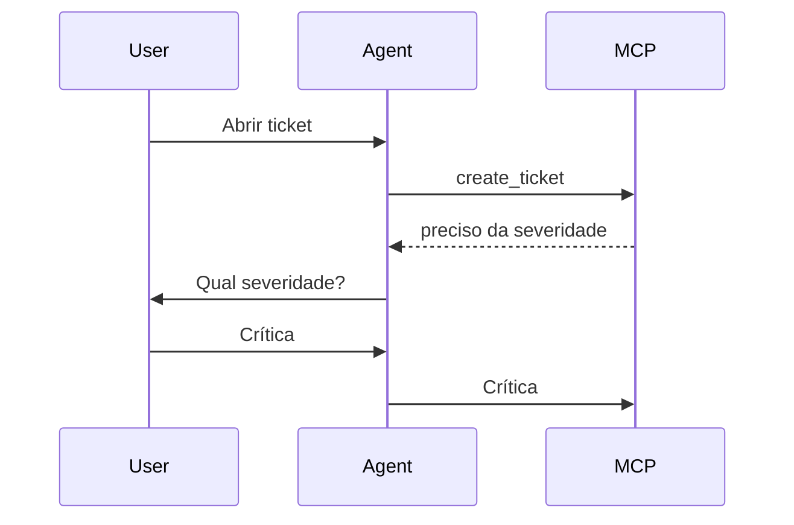

# Capabilities

Na prática, os filhos de capabilities normalmente NÃO ficam vazios em um  MCP Server real.

O exemplo mostrado com {} é apenas o mínimo para ilustrar o handshake.

| Valor            | Significado                        |
| ---------------- | ---------------------------------- |
| ausente          | Não suporte notificação de mudança |
| false            | Lista considerada fixa             |
| true             | Lista pode mudar dinamicamente     |
| tools não existe | O servidor não suporta tools       |

Durante o initialize, o servidor informa ao cliente:

"Estas são as funcionalidades MCP que eu implemento."

É parecido com o Swagger/OpenAPI dizendo quais endpoints existem.

Estrutura geral

```json
{
"result": {
   "protocolVersion": "2026-07-28",
   "capabilities": {
      "tools": {},
      "resources": {},
      "prompts": {},
      "logging": {},
      "elicitation": {},
      "sampling": {}
   }
}
}
```
Nem todas precisam existir.

## tools

Indica que o servidor possui ferramentas executáveis.

Exemplo:

```json
{
"capabilities": {
   "tools": {
      "listChanged": true
   }
}
}
```

Para que serve

Permite:

```text
tools/list
tools/call
```

Exemplo no seu caso:

```text
network.get_alarm
inventory.search
itsm.search_change
```

Quando usar: Sempre que o MCP for acionar algo.

Por exemplo:

```text
Consultar alarme
Criar ticket
Executar diagnóstico
```

## resources

Indica que existem recursos consultáveis.

Exemplo:

```json
{
"capabilities": {
   "resources": {
      "subscribe": true,
      "listChanged": true
   }
}
}
```

Para que serve

Permite:

```text
resources/list
resources/read
```

Exemplo:

```text
alarm://
kpi://
inventory://
wiki://
```

## subscribe

Indica que o cliente pode assinar eventos.

```text
resource atualizado
novo KPI
novo alarme
```

## listChanged

O servidor consegue avisar:

a lista de resources mudou

Por exemplo:

Nova documentação Ericsson adicionada

## prompts

Indica prompts reutilizáveis.

Exemplo:

```json
{
"capabilities": {
   "prompts": {
      "listChanged": true
   }
}
}
```

Permite:

prompts/list
prompts/get

Exemplo:

analise_rede
analise_mgw
analise_ericsson

## logging

Permite envio de mensagens operacionais.

```json
{
"capabilities": {
   "logging": {}
}
}
```

Exemplo:

Conectando API Ericsson
Executando consulta KPI
Timeout no banco

Mensagem:
```json
{
"method": "notifications/message"
}
```

## sampling

Uma das capacidades mais interessantes.

Ela permite que o servidor peça ao cliente para usar o LLM.

Fluxo:

Server
↓
"Copilot, me ajude a resumir isso"
↓
Cliente chama LLM
↓
Devolve texto ao servidor

Exemplo real

Seu MCP consulta:

500 alarmes

O MCP não quer devolver tudo.

Pode pedir:

Resuma os alarmes
Agrupe por severidade
Explique os impactos

para o LLM.

Fluxo:

sequenceDiagram

   participant Agent
   participant MCP
   participant LLM

   Agent->>MCP: tools/call

   MCP->>LLM: sampling

   LLM-->>MCP: resumo

   MCP-->>Agent: resultado

## elicitation

Permite ao MCP solicitar informações adicionais ao usuário.

Exemplo:

Usuário fala:

Abra um ticket

O MCP precisa saber:

Qual sistema?
Qual severidade?

Então:

MCP -> Cliente
Solicite mais dados ao usuário

Fluxo



## roots

Muito útil para RAG.

Permite que o cliente informe ao servidor quais fontes de documentos ele  pode acessar.

Exemplo:

```json
{
"capabilities": {
   "roots": {
      "listChanged": true
   }
}
}
```

Exemplo real

O Copilot informa:

SharePoint A
OneDrive B
Pasta X

O MCP utiliza esses locais para buscar documentos.

## subscriptions

Nas versões mais recentes aparece associado aos recursos.

Serve para notificações assíncronas.

Exemplo:

Novo alarme
KPI alterado
Change criada

## completion

Alguns clientes suportam autocompletar parâmetros.

Exemplo:

Usuário digita:

Consultar device ERBS_

O MCP sugere:

ERBS001
ERBS002
ERBS003

O que eu recomendaria para seu MCP TABLE

Inicialmente anunciar apenas:
```json
{
"capabilities": {
   "tools": {},
   "resources": {},
   "logging": {}
}
}
```

Porque você pretende expor APIs REST.

Depois evoluir para:

```json
{
"capabilities": {
   "tools": {
      "listChanged": true
   },
   "resources": {
      "subscribe": true,
      "listChanged": true
   },
   "logging": {},
   "elicitation": {}
}
}
```

E somente numa terceira fase adicionar:

```json
{
"sampling": {},
"roots": {}
}
```

Essas duas últimas normalmente fazem sentido quando o MCP deixa de ser  apenas um "adaptador REST" e passa a participar ativamente de fluxos de IA  e RAG.

Para o cenário de API TABLE, diria que 95% das implementações precisam apenas de tools, resources, logging e opcionalmente elicitation. sampling e roots costumam aparecer apenas em arquiteturas MCP mais sofisticadas.
