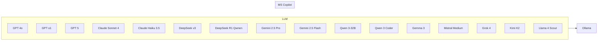

# Comparação entre Ollama e Microsoft Copilot

```mermaid
graph LR
    
    subgraph llm[LLM]
        gpt_4o[GPT 4o]
        gpt_41[GPT 4.1]
        gpt_41[GPT o1]
        gpt_5[GPT 5]
        claude_4[Claude Sonnet 4]
        claude_35[Claude Haiku 3.5]
        ds_3[DeepSeek v3]
        ds_r1q[DeepSeek R1 Qwnen]
        Gemini_25p[Gemini 2.5 Pro]
        Gemini_25f[Gemini 2.5 Flash]
        qw_3[Qwen 3-32B]
        qw_3c[Qwen 3 Coder]
        Gemma[Gemma 3]
        Mistral[Mistral Medium]
        Grok_4[Grok 4]
        kimi_k2[Kimi K2]
        Llama_3[Llama 4 Scout]
    end
    subgraph copilot[MS Copilot]
    end

    llm --> Ollama
```
