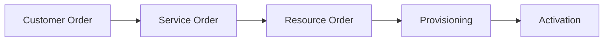

# TM Forum (TeleManagement Forum)

https://www.youtube.com/watch?v=SrGwVDDpzhA

Code + Frameworks (ODA, IDS,Open APIs)

O **TM Forum (TeleManagement Forum)** é uma associação global sem fins lucrativos que reúne operadoras de telecomunicações, provedores de tecnologia, fabricantes de equipamentos, integradores e empresas de software para definir padrões e acelerar a transformação digital do setor de telecomunicações. Segundo o próprio TM Forum, a organização possui mais de **800 empresas membros**, incluindo grandes operadoras, hyperscalers, fornecedores de rede e integradores.

Para quem trabalha em operadoras de telecomunicações, o TM Forum é praticamente a principal referência mundial para:

- Processos OSS/BSS
- Arquiteturas de sistemas TELCO
- APIs padronizadas
- Automação de redes
- IA aplicada a telecom
- Governança de dados
- Transformação digital

## Principais Frameworks do TM Forum

### 1\. eTOM (Enhanced Telecom Operations Map)

O eTOM é o framework de processos da operadora.

Define como organizar processos como:

- Atendimento ao cliente
- Provisionamento
- Billing
- Assurance
- Trouble Ticket
- Gestão de Rede
- Gestão de Parceiros
- Planejamento de Capacidade

Exemplo:

Na prática, boa parte dos fluxos de OSS/BSS modernos se inspira no eTOM.

### 2\. SID (Shared Information/Data Model)

É o modelo de dados de referência.

Padroniza entidades como:

- Customer
- Service
- Resource
- Product
- Party
- Organization
- Location

Isso reduz a necessidade de cada fornecedor criar um modelo próprio.

### 3\. TAM (Telecom Application Map)

É o mapa de aplicações de uma operadora.

Mostra onde cada sistema se encaixa:

- CRM
- Order Management
- Inventory
- Billing
- Service Assurance
- Workforce
- Mediation
- Analytics

Historicamente era um dos pilares do Frameworx.

## Frameworx

Durante muitos anos o principal conjunto de padrões do TM Forum foi chamado de **Frameworx**.

Incluía:

- eTOM
- SID
- TAM
- Integration Framework

## ODA (Open Digital Architecture)

Hoje o grande foco do TM Forum é a **ODA (Open Digital Architecture)**.

A ODA é a evolução natural do Frameworx para ambientes:

- Cloud Native
- Kubernetes
- Microservices
- API First
- DevOps
- AI Driven

Segundo a documentação do TM Forum, a ODA reutiliza ativos maduros como eTOM, SID e Open APIs, mas os reorganiza em uma arquitetura baseada em componentes e APIs abertas. [\[projects.tmforum.org\]](https://projects.tmforum.org/wiki/download/attachments/190509214/Collaboration%20Projects.pdf?version=1&modificationDate=1643269187000&api=v2), [\[tmforum.org\]](https://www.tmforum.org/)

### Conceitos da ODA

#### Componentes

Ao invés de sistemas monolíticos:

CRM

Billing

Inventory

Provisioning

temos componentes independentes:

Product Catalog Component

Order Component

Inventory Component

Partner Component

Customer Component

#### API First

Tudo se integra usando Open APIs do TM Forum.

Exemplo:

TMF620 Product Catalog

TMF622 Product Order

TMF629 Customer Management

TMF637 Product Inventory

TMF641 Service Order

Existem dezenas de APIs oficiais TMF amplamente utilizadas pela indústria. [\[github.com\]](https://github.com/tmforum-apis)

## Open APIs

Talvez sejam hoje o ativo mais importante do TM Forum.

O catálogo público possui APIs como:

| API | Função |
| --- | --- |
| TMF620 | Product Catalog |
| --- | --- |
| TMF622 | Product Order |
| TMF629 | Customer |
| TMF641 | Service Order |
| TMF637 | Product Inventory |
| TMF638 | Service Inventory |
| TMF639 | Resource Inventory |
| TMF644 | Service Activation |
| TMF653 | Service Test |
| TMF921 | Intent API |
| TMF915 | AI Management |

[\[github.com\]](https://github.com/tmforum-apis)

Muitas RFPs de operadoras já exigem:

> "TM Forum Open API compliant"

## Autonomous Networks (ANL)

O TM Forum criou o framework:

**ANL (Autonomous Network Levels)**:

Que mede o nível de autonomia da rede.

- Nível 0: Manual, Operador faz tudo
- Nível 1: Assistido
- Nível 2: Automação parcial
- Nível 3: Closed-loop automation
- Nível 4: Rede amplamente autônoma
- Nível 5: Rede totalmente autônoma

## Intent Based Architecture

Outro tema muito forte no TM Forum moderno.

Ao invés de informar:

Execute estes comandos

informa-se:

Garanta 99,99% de disponibilidade

A arquitetura decide automaticamente:

- ações
- configurações
- correções

## Catalyst

Os Catalyst Projects são um dos programas mais famosos do TM Forum.

Funcionam como laboratórios colaborativos.

Participam:

- Operadoras
- Vendors
- Integradores
- Cloud Providers

Objetivo:

Construir PoCs reais.

Durante a reunião foi citado que projetos Catalyst recentes combinaram:

- IA
- Automação
- ODA
- Open APIs

## Certificações TM Forum

Certificações bastante valorizadas em arquitetura OSS/BSS:

- ODA
  - ODA Fundamentals
  - ODA Practitioner
- Open APIs
  - Open API Practitioner
  - Open API Developer
- Autonomous Networks
  - ANL Skill Path
- Processos
  - eTOM
  - SID
  - TAM

## Por que o TM Forum é importante para a Teleco?

Pelo seu contexto em Core Engineering, automação, OSS e iniciativas de IA, os ativos mais relevantes são:

1. **Open APIs**
   - Integração entre sistemas.
2. **ODA**
   - Modernização da arquitetura.
3. **ANL/ANJ**
   - Jornada de redes autônomas.
4. **Intent-Based Networking**
   - Próxima geração de automação.
5. **Catalyst**
   - Benchmark internacional.
6. **eTOM**
   - Mapeamento de processos.
7. **SID**
   - Padronização de dados.
8. **TMF Open Gateway**
   - Integração com iniciativas GSMA/Open Gateway.
