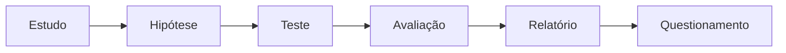
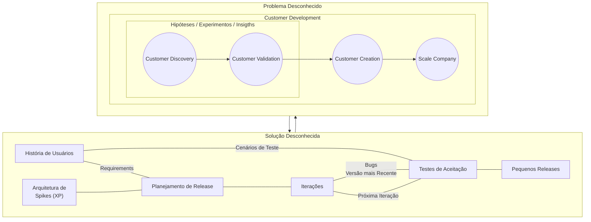
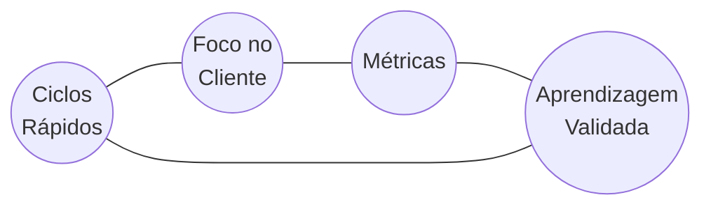
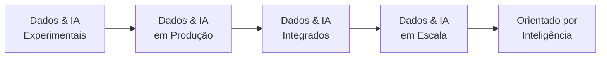
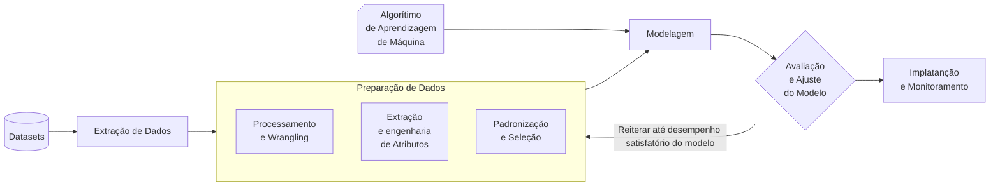

# Algorítimos e suas Aplicações

https://github.com/ahirtonlopes/TIM-AI-Academy

## Processo de Machine Learning


1. Definição do caso de uso
2. Aquisição e exploraçãodos Dados
3. Seleção do [Algorítimos/Modelo](../Models/Models.md)
4. Pipeline de dados e Feature Engineering
5. Construção do Modelo de Machine Learning
6. Validação
7. Apresentação dos resultados
8. Planejamento da implantação
9. Operacionalização do modelo
10. Monitoramento do modelo

## Estrutura Básica ML-Machine Learning (Aprendizado de Máquina)

1. Definição do caso de uso
2. Aquisição e exploraçãodos Dados
3. Sanitização dos Dados
4. Seleção do [Algorítimos/Modelo](../Models/Models.md) de Treinamento
5. [Métricas](../Metrics.md) de Avaliação
6. Treinamento do Modelo
7. Teste do Modelo
8. Implementação do Modelo

## Método Científico






## Método Lean Startup

- Customer Development
- Problem (Hipóteses, Esperimentos, Insights) -> Solution (Dados, Feedback, Insights)
- Cenários de Teste
- História de Usuários


## Processo de Descoberta de Conhecimento / KDD: Knowledge Discovery In Databases

1. Obtenção de Dados
2. Pré-processamento de dados
3. Processamento de dados / Mineração de dados
4. Pós-processamento


## CRISP-DM

1. Entendimento de Negócios
2. Entendimento de Dados
3. Preparação dos Dados
4. Modelagem
5. Avaliação
6. Deploy


## Os 7 Padrões da Inteligência Artificial


## Desenvolvimento de Sistem de IA



## Método Lean


## Maturidade de Dados IA no Cenário Global




## Machine learning Canvas

https://www.ownml.co/machine-learning-canvas


## Hype Cycle (garther)

https://www.gartner.com.br/pt-br/artigos/novidades-no-gartner-hype-cycle-for-emerging-technologies-de-2022


## Análise Exploratória de Dados / EDA - Explore Data Analise


Vantagens:
- Identificação de Padrões e Tendências
- Detecção de Outliers e Valores Ausentes
- Insights Preliminares
- Qaulidade dos Processos

## Coleta de Dados

- Fontes:
  - Dispositivos IoT
  - Aplicativos Móveis
  - Sistemas Operacionais
  - Mídias Sociais
  - Multimídias
  - Transações
  - Parcerias
- Métodos:
  - Primários: Fontes originais
    - Estatísticas
    - Questionários
    - Pesquisas
    - Entrevistas
    - Grupos Focais
  - Secundários: Fontes preexistentes
    - Relatórios
      - Financeiros
      - Comerciais
      - Governamentais
    - Missão e Visão de Negócios
    - Internet
- Passos:
  1. Planejamento e Identificação das Necessidades
     - Estudo:
       - Tipos de Dados
       - Variáveis de Interesse
         - Identificação de Dados Faltantes
         - Tratamento de Variáveis Categóricas
         - Levantamento de Hipóteses
         - Entendimento da Distribuição
         - Detecção de Valores Inesperados
         - Magnitude dos Atributos
       - Viabilidade
     - Recursos:
       - Orçamento
       - Ressoal
       - Requisitos de Coelta
     - Conclusões de Correlação e Acurácia:
       - Lidar com Dados Insuficientes ou Inapropiados
     - Testes Estatísticos:
       - Metodologias
       - Avaliação
     - Consiterações Éticas:
       - Concentimento
       - Privacidade
       - Confidencialidade
  2. Design e Preparação
     - Nomenclatura
     - Tipo de Dados
     - Definição Operacional
     - Fatores de Estratificação
     - Amostragem
     - Quem e Como
  3. Garantia de Qualidade
  4. Armazenamento dos Dados
  5. Anotação dos Exemplos
  6. Documentação do Processo
- Técnicas de Tratamento para Dados Faltantes
  ```mermaid
    flowchart LR

      dados[Dados Faltantes]
      perc((%))
      subgraph del[Remoção de Valores]
        direction TB
        Lista
        Pares
        Col[Remoção de Colunas]
      end 
      input[Input de Valores]
      uni[Univariada]
      mult[Multivariada]

      subgraph uni_num[Numéricos]
        direction TB
        Média
        Mediana
        Distribuição
        Aleatório
      end 
      subgraph uni_cat[Categóricos]
        direction TB
        Moda
        Arbitrário
      end 
      subgraph mult_knn[KNN]
        direction TB
        len[Distâncias mais próximas]
      end 
      subgraph mult_mice[MICE]
        direction TB
        mice[" "]
      end 

      dados & del --> perc --> input --> uni & mult
      uni --> uni_num & uni_cat
      mult --> mult_knn & mult_mice

  ```

## Fluxo da Engenharia de Atributos


