# Class Diagram

[https://mermaid.js.org/syntax/classDiagram.html](https://mermaid.js.org/syntax/classDiagram.html)

## Examples

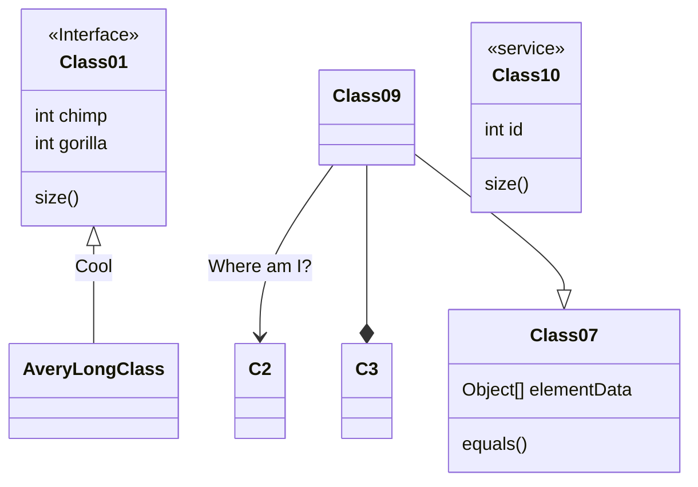

## Class

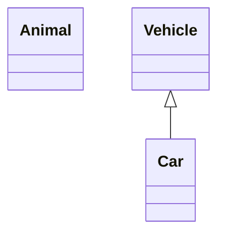

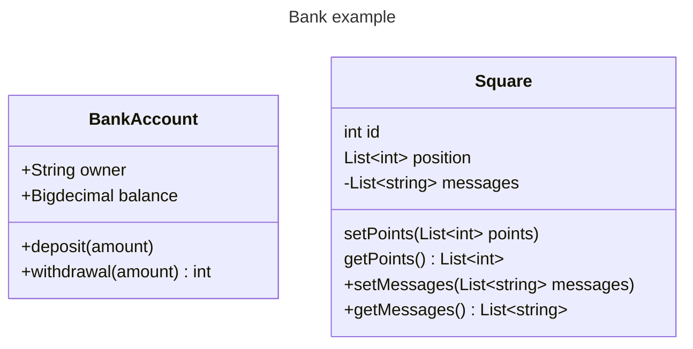

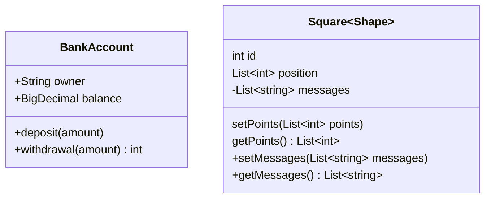

## Visibility

```text
before members:
   Public      e.g.: publicMethod()      publicVar
 + Public      e.g.: +publicMethod()     +publicVar
 - Private     e.g.: -privateMethod()    -privateVar
 # Protected   e.g.: #protectedMethod()  #protectedVar
 ~ Package     e.g.: ~package
 ~ Internal    e.g.: ~internal
after members:
 Abstract*     e.g.: abstractMethod()*   abstractVar*
 Static$       e.g.: staticMethod()$     staticVar$
```

## Relationship / Arrow

| Relationship Type | Description   |
| ----------------- | ------------- |
| <\|--             | Inheritance   |
| *--               | Composition   |
| o--               | Aggregation   |
| -->               | Association   |
| --                | Link (Solid)  |
| ..>               | Dependency    |
| ..\|>             | Realization   |
| ..                | Link (Dashed) |

> Relationship= \[Relation Type\]\[Link\]\[Relation Type\]

| Relation Type | Description |
| ------------- | ----------- |
| <\|           | Inheritance |
| *             | Composition |
| o             | Aggregation |
| >             | Association |
| <             | Association |
| \|>           | Realization |

| Link | Description |
| ---- | ----------- |
| --   | Solid       |
| ..   | Dashed      |

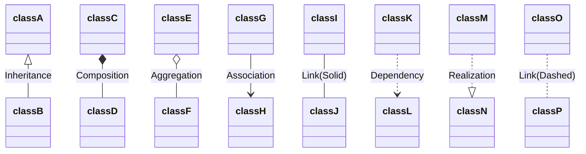

blending

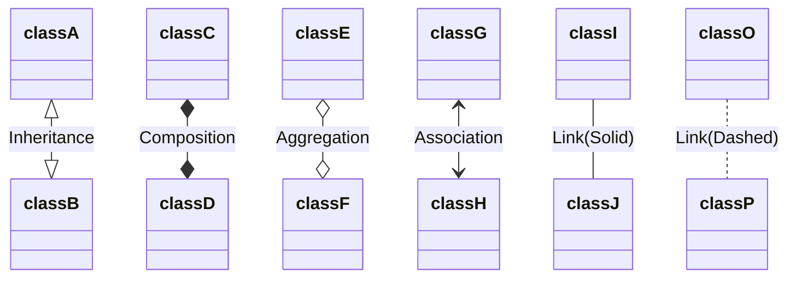

blending

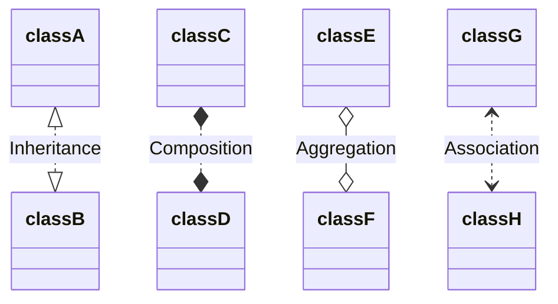

## Cardinality / Multiplicity on relations

| Cardinality | Description |
| ----------- | ----------- |
| 1           | Only 1      |
| 0..1        | Zero or One |
| 1..*        | One or more |
| *           | Many        |
| n           | n           |
| 0..n        | zero to n   |
| 1..n        | one to n    |

> [classA] "cardinality1" [Arrow] "cardinality2" [ClassB]:LabelText

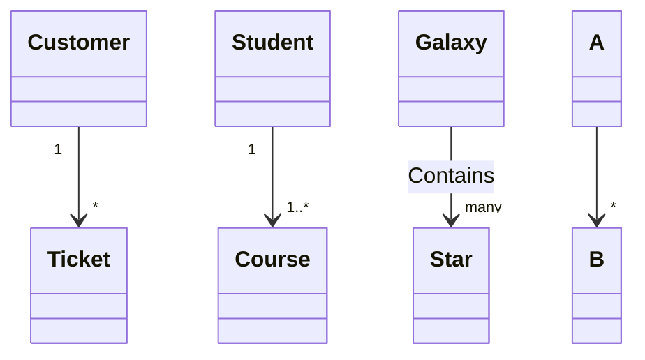

## Annotations on classes

| Annotations         | Description                     |
| ------------------- | ------------------------------- |
| \<\<Interface\>\>   | To represent an Interface class |
| \<\<Abstract\>\>    | To represent an abstract class  |
| \<\<Service\>\>     | To represent a service class    |
| \<\<Enumeration\>\> | To represent an enum            |

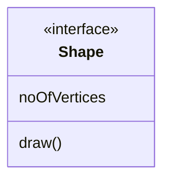

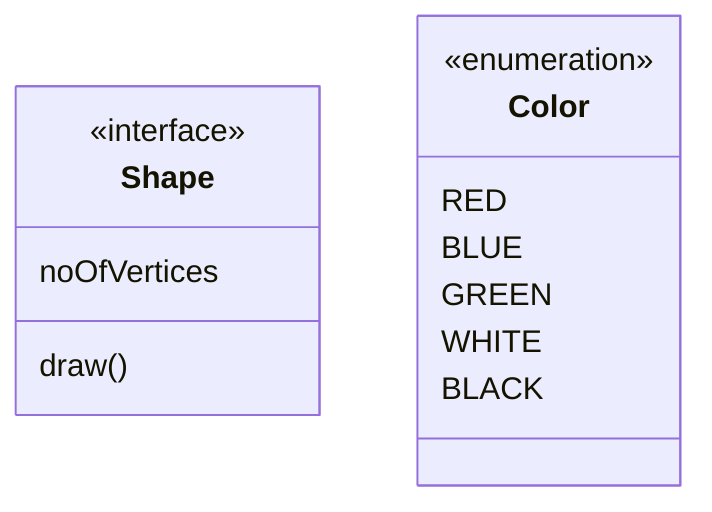

## Setting the direction of the diagram

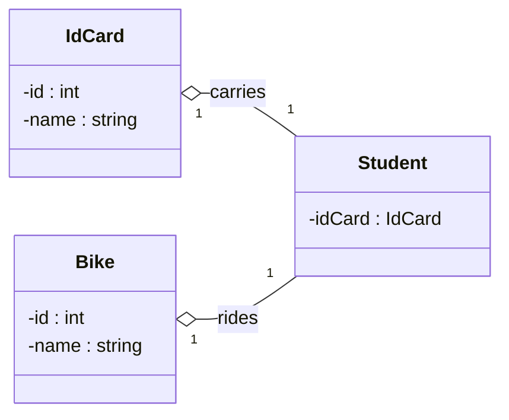

## Interaction

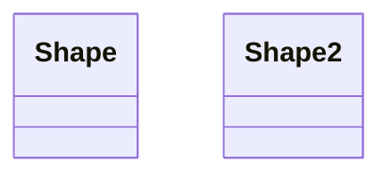

<script>
  const callbackFunction = function () {
    alert('A callback was triggered');
  };
</script>


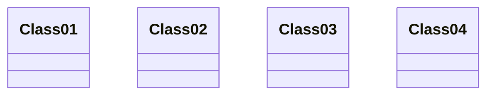
