# Flowchart LR

[https://mermaid.js.org/syntax/flowchart.html](https://mermaid.js.org/syntax/flowchart.html)

## Use

flowchart `<direction>`

## Examples

```mermaidtitle: Title exampleflowchart LR

A-->B
```

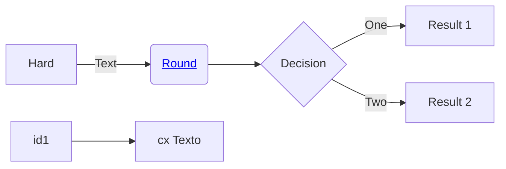

## Shapes

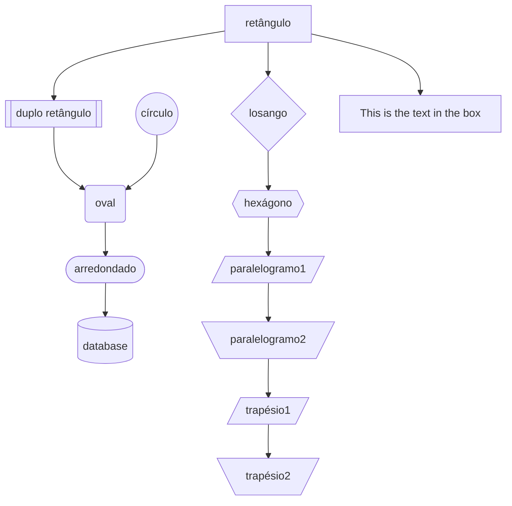

## Links - Arrows

| Length            | 1    | 2     | 3      |
| ----------------- | ---- | ----- | ------ |
| Normal            | ---  | ----  | -----  |
| Normal with arrow | -->  | --->  | ---->  |
| Thick             | ===  | ====  | =====  |
| Thick with arrow  | ==>  | ===>  | ====>  |
| Dotted            | -.-  | -..-  | -...-  |
| Dotted with arrow | -.-> | -..-> | -...-> |

### Normal

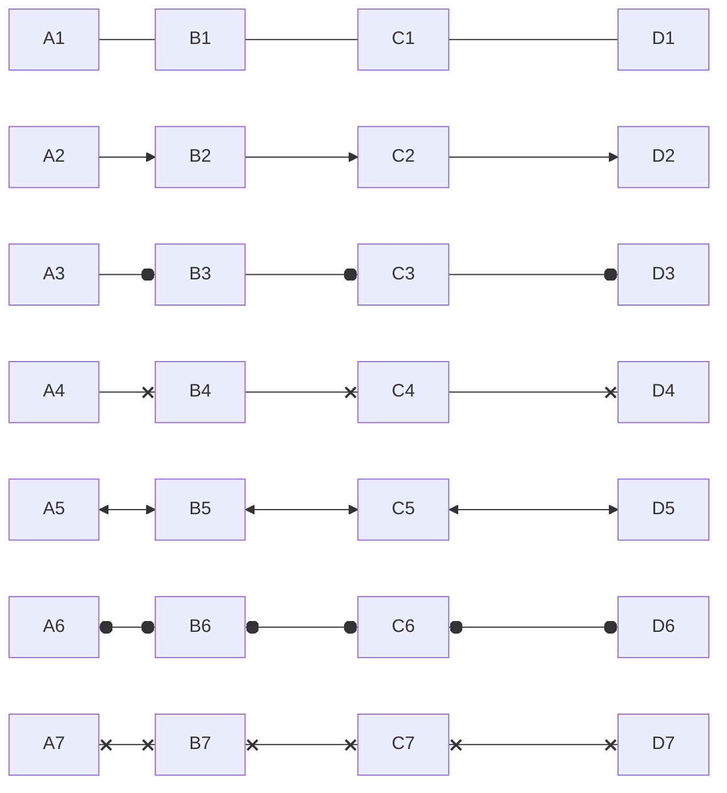

### Thick

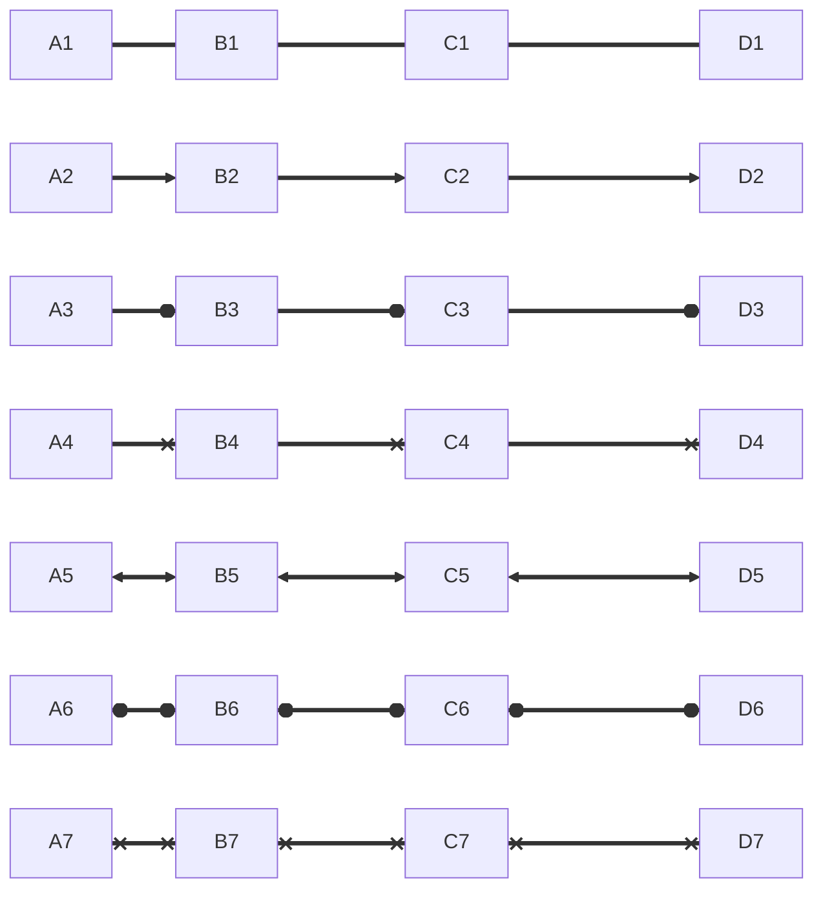

### Dotted

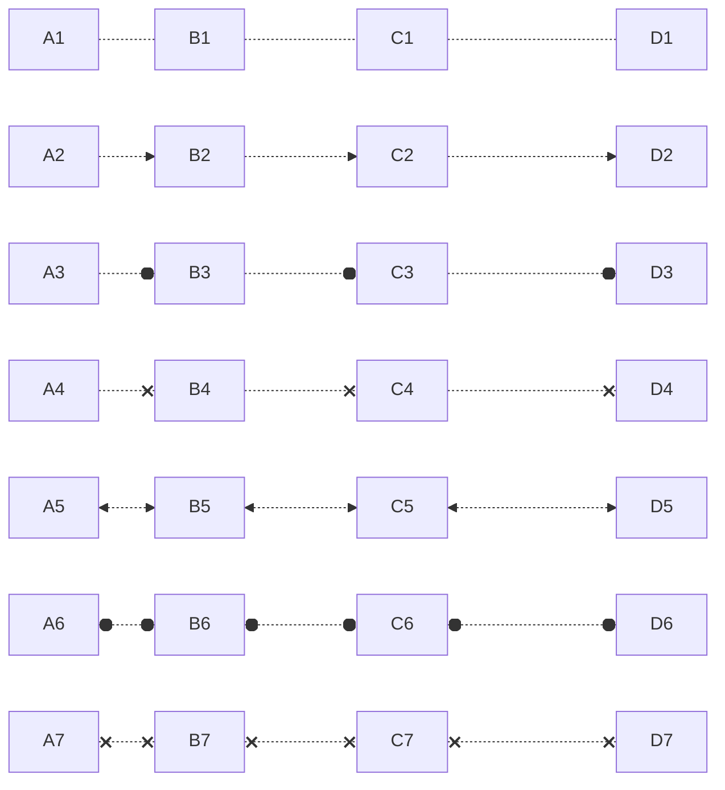

## Links - Arrows Name

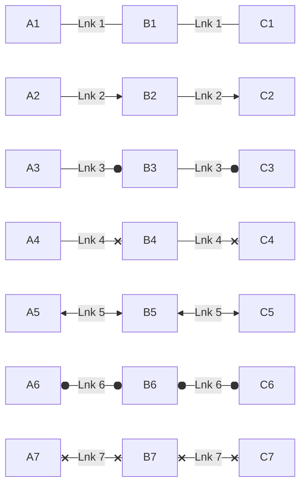

## Joins

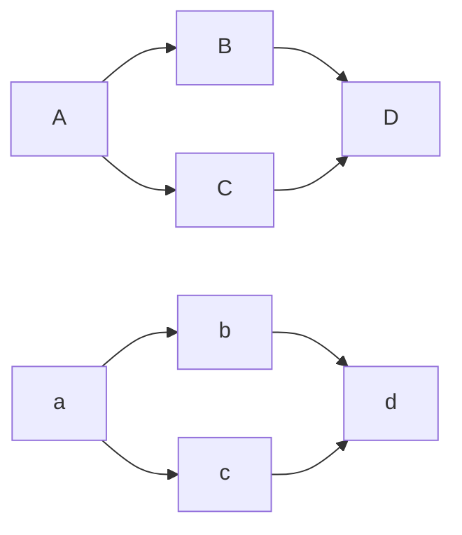

other

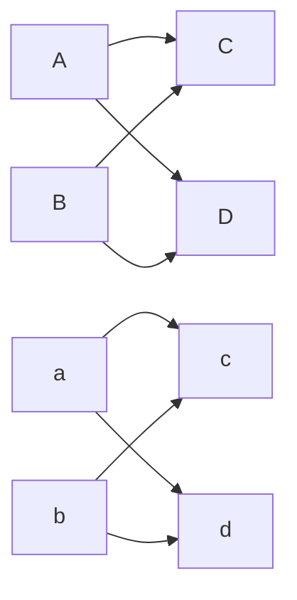

## Escape characters


## Subgraphs

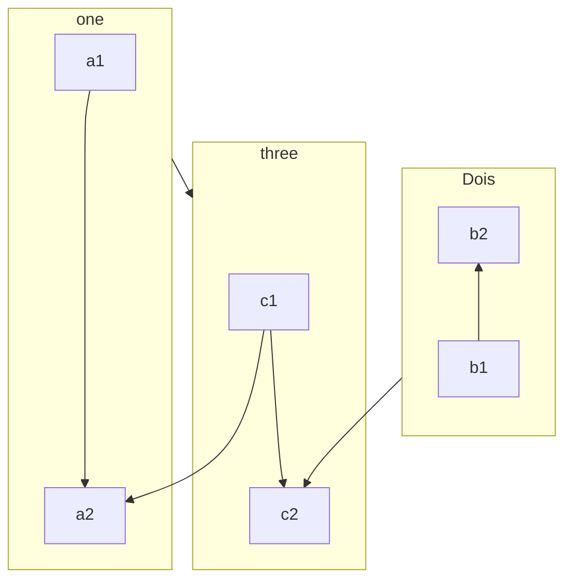

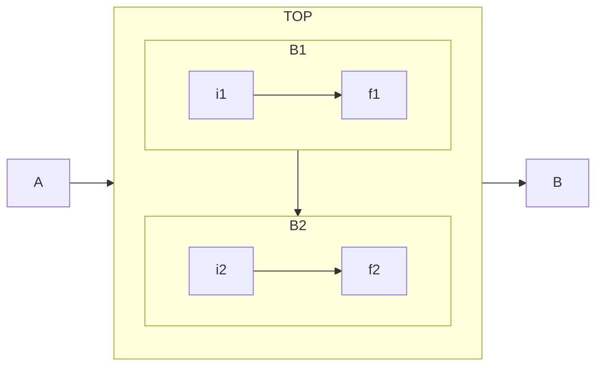

## Direction in subgraphs

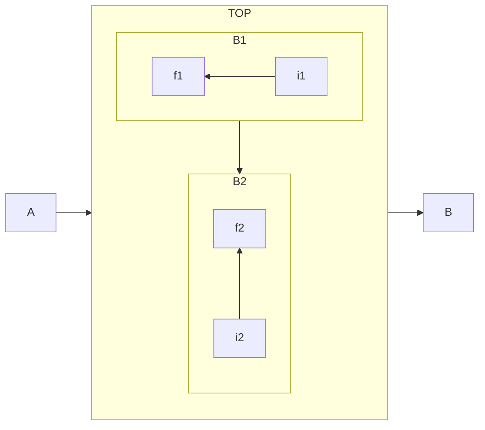

## Interaction

<script>
const callback=function () {
 alert('Hi!');
}
</script>

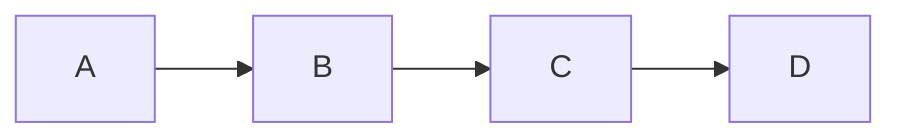

## Comments

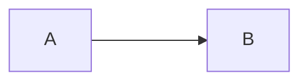

## Styling and classes

<style>
  .cssClass > rect {
    fill: #ff0000;
    stroke: #ffff00;
    stroke-width: 4px;
  }
</style>

- Syntaxe:
  - style `<id>` `<Attribute List>`
  - classDef `<className>` `<Attribute List>`
- Attribute List
  - attribute1:value1,attributeN:valueN;
- Attributes
  - color: Foreground Color
  - fill: Background Color
  - stroke: Line Color
  - stroke-width: Width Line
- curve styles: basis, bump, linear, monotoneX, monotoneY, natural, step, stepAfter and stepBefore.

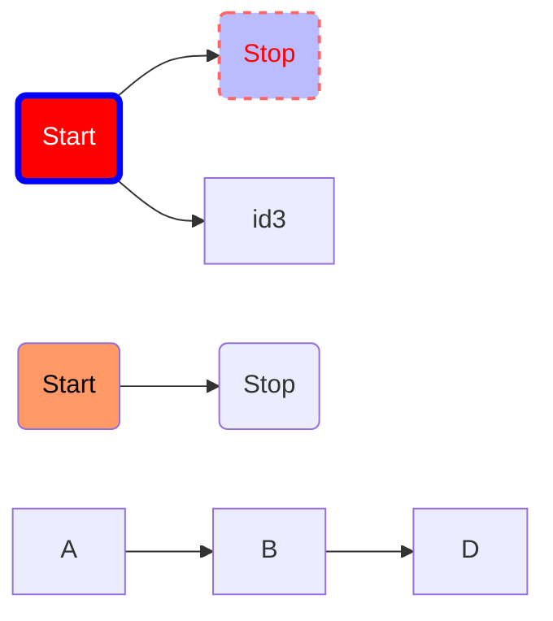

## Formas de aplicar estilos no Mermaid

### **Usando `style id`**

Aplica o estilo diretamente a um nó específico (override total).

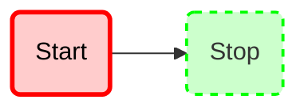

### **Usando `classDef` e `class`**

Define uma classe de estilo e aplica-a a um ou mais elementos.

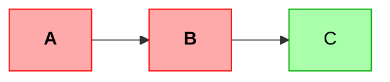

> Ideal para **vários nós com o mesmo estilo**.

### **Usando CSS embutido com `<style>`**

Permite selecionar nós com seletores CSS, como `rect`, `circle`, `.class > rect`, etc.

```html
<style>
  .cssClass > rect {
    fill: #ff0000;
    stroke: #ffff00;
    stroke-width: 4px;
  }
  .rounded > rect {
    rx: 10;
    ry: 10;
  }
  .important > rect {
    fill: #ffe600;
    stroke: #000;
  }
</style>
```
<style>
  .cssClass > rect {
    fill: #ff0000;
    stroke: #ffff00;
    stroke-width: 4px;
  }
  .rounded > rect {
    rx: 10;
    ry: 10;
  }
  .important > rect {
    fill: #ffe600;
    stroke: #000;
  }
</style>

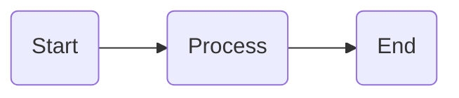

### **Usando `linkStyle` para estilizar linhas**

Aplica estilo às **conexões (edges)** com base na ordem em que aparecem.

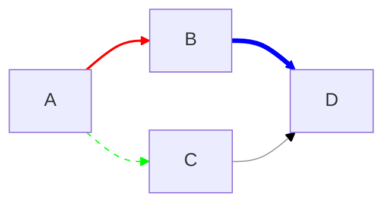

> `linkStyle <número>` se refere à **ordem dos links declarados** no diagrama.

### **Usando `classDef` para links (desde Mermaid v10.5)**

Permite criar estilos de links nomeados.

```mermaid
flowchart LR
  A --> B
  A --> C
  linkStyle default interpolate basis
  classDef dashedLink stroke-dasharray: 5 5, stroke:#ff6600
  linkStyle 1 class dashedLink
```

### **Usando `%%{init: {...}}%%` com `themeVariables`**

Define estilos globais, como cores de nós, bordas e fontes.

```mermaid
%%{init: {"themeVariables": {
  "primaryColor": "#ffdddd",
  "primaryBorderColor": "#ff0000",
  "primaryTextColor": "#000",
  "edgeLabelBackground":"#fff0f0"
}}}%%

flowchart LR
  A(Start) --> B{Decision}
  B -->|Yes| C[Continue]
  B -->|No| D[Stop]
```

### **Agrupando classes e estilos combinados**

Você pode misturar `style`, `classDef`, `linkStyle` e CSS no mesmo gráfico.

````html
<style>
  .cssGroup > rect {
    fill: #0099ff;
    stroke: #004477;
    stroke-width: 2px;
  }
</style>

```mermaid
flowchart LR
  id1(Start):::cssGroup --> id2(Stop):::alerta
  id1 --> id3(Decision)
  id3 -->|Yes| id4(Success):::sucesso
  id3 -->|No| id5(Failure):::alerta

  classDef alerta fill:#fdd,stroke:#f00,color:#000
  classDef sucesso fill:#dfd,stroke:#0a0,color:#000
  style id3 fill:#ffd,stroke:#cc0,stroke-width:3px

  linkStyle 0 stroke:#00f,stroke-width:2px
  linkStyle 1 stroke:#0f0,stroke-width:2px
  linkStyle 2 stroke:#f00,stroke-width:2px,stroke-dasharray:3 3
````

### Dica Extra

Você pode **combinar classes** em um mesmo nó:

```mermaid
flowchart LR
  A:::alerta:::rounded --> B:::sucesso
  classDef alerta fill:#fdd,stroke:#f00
  classDef rounded stroke-width:2px
  classDef sucesso fill:#dfd,stroke:#0a0
```

## Tabela de Atributos — `classDef`

| **Atributo**       | **Tipo de valor**                                           | **Exemplo**                     | **Descrição / Efeito**                                              |
| ------------------ | ----------------------------------------------------------- | ------------------------------- | ------------------------------------------------------------------- |
| `fill`             | Cor (`#RRGGBB`, `rgb()`, `rgba()`, nome CSS)                | `fill:#ffaaaa`                  | Cor de fundo do nó.                                                 |
| `fill-opacity`     | Número entre `0.0` e `1.0`                                  | `fill-opacity:0.6`              | Transparência da cor de fundo.                                      |
| `stroke`           | Cor (`#RRGGBB`, `rgb()`, `rgba()`, nome CSS)                | `stroke:#ff0000`                | Cor da borda do nó.                                                 |
| `stroke-width`     | Número + unidade opcional (`px`)                            | `stroke-width:3px`              | Espessura da borda.                                                 |
| `stroke-dasharray` | Lista de números separados por espaço                       | `stroke-dasharray:5 5`          | Cria borda tracejada (comprimento dos traços/espaços).              |
| `stroke-opacity`   | Número entre `0.0` e `1.0`                                  | `stroke-opacity:0.5`            | Transparência da borda.                                             |
| `color`            | Cor (`#RRGGBB`, `rgb()`, `rgba()`, nome CSS)                | `color:#000000`                 | Cor do texto dentro do nó.                                          |
| `font-size`        | Número + unidade (`px`, `em`)                               | `font-size:16px`                | Tamanho da fonte.                                                   |
| `font-family`      | Nome da fonte (CSS)                                         | `font-family:Arial, sans-serif` | Fonte do texto.                                                     |
| `font-weight`      | Palavra-chave (`bold`, `normal`, `bolder`, etc.)            | `font-weight:bold`              | Espessura da fonte.                                                 |
| `font-style`       | Palavra-chave (`italic`, `normal`)                          | `font-style:italic`             | Estilo da fonte (itálico, normal).                                  |
| `text-align`       | `left`, `center`, `right`                                   | `text-align:center`             | Alinhamento horizontal do texto.                                    |
| `text-decoration`  | `underline`, `overline`, `line-through`, etc.               | `text-decoration:underline`     | Decoração do texto.                                                 |
| `rx`               | Número (px)                                                 | `rx:10`                         | Raio de arredondamento do canto horizontal (bordas arredondadas).   |
| `ry`               | Número (px)                                                 | `ry:10`                         | Raio de arredondamento vertical.                                    |
| `opacity`          | Número entre `0.0` e `1.0`                                  | `opacity:0.8`                   | Transparência geral do nó (inclui texto e borda).                   |
| `padding`          | Número + unidade (`px`)                                     | `padding:5px`                   | Espaçamento interno (nem sempre suportado em todos os tipos de nó). |
| `stroke-linejoin`  | `miter`, `round`, `bevel`                                   | `stroke-linejoin:round`         | Define o formato da junção de bordas.                               |
| `stroke-linecap`   | `butt`, `round`, `square`                                   | `stroke-linecap:round`          | Define o formato das extremidades da linha.                         |
| `background`       | Cor                                                         | `background:#fff8e1`            | Sinônimo de `fill` (interpretação alternativa).                     |
| `border-radius`    | Número (px)                                                 | `border-radius:10px`            | Alias de `rx`/`ry` (para nós retangulares).                         |
| `transition`       | Propriedade CSS                                             | `transition: all 0.3s ease`     | Transições suaves em temas interativos.                             |
| `animation`        | Propriedade CSS                                             | `animation: pulse 2s infinite`  | Animações (quando suportadas).                                      |
| `text-outline`     | `color tamanho`                                             | `text-outline:#fff 2px`         | Contorno do texto (usado em alguns temas).                          |
| `text-background`  | Cor                                                         | `text-background:#ffffff`       | Fundo da área de texto.                                             |
| `shape`            | `rect`, `circle`, `stadium`, `subroutine`, `cylinder`, etc. | `shape:stadium`                 | Força o formato do nó (pode variar conforme tipo de grafo).         |
| `label-position`   | `top`, `bottom`, `left`, `right`, `center`                  | `label-position:bottom`         | Posição do texto dentro do nó.                                      |
| `width`            | Número (`px` ou sem unidade)                                | `width:150px`                   | Largura do nó.                                                      |
| `height`           | Número (`px` ou sem unidade)                                | `height:50px`                   | Altura do nó.                                                       |

## Observações importantes

- O Mermaid interpreta **`classDef`** como uma tradução direta de **atributos SVG e CSS inline**, então a maioria das propriedades visuais CSS são válidas.
- Entretanto, nem todas têm suporte uniforme em **todos os tipos de grafo** (flowchart, state, sequence, etc.).
- `rx` e `ry` só afetam nós baseados em retângulos.
- `fill`, `stroke`, `color` e `font-*` são os mais universais.

## Exemplo completo

```mermaid
flowchart LR
  A(Start):::alerta --> B(Process):::sucesso
  B --> C(Decision):::neutro

  classDef alerta fill:#ffdddd,stroke:#ff0000,color:#000,font-weight:bold,rx:10,ry:10
  classDef sucesso fill:#ddffdd,stroke:#00aa00,font-style:italic,stroke-width:2px
  classDef neutro fill:#ddddff,stroke:#3333ff,stroke-dasharray:5 5,opacity:0.9
```
