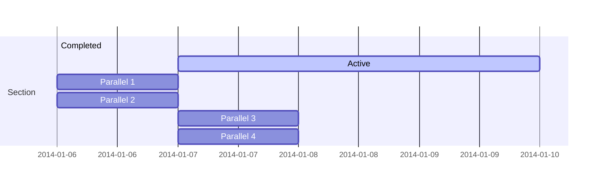
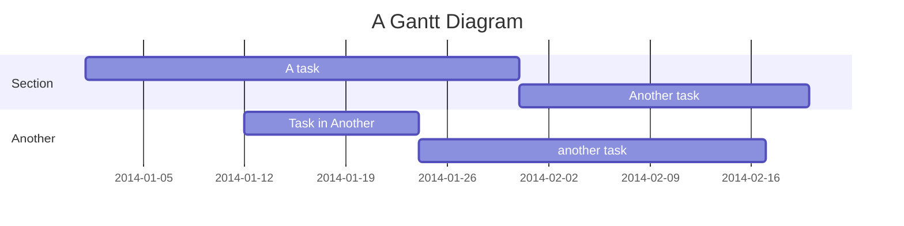
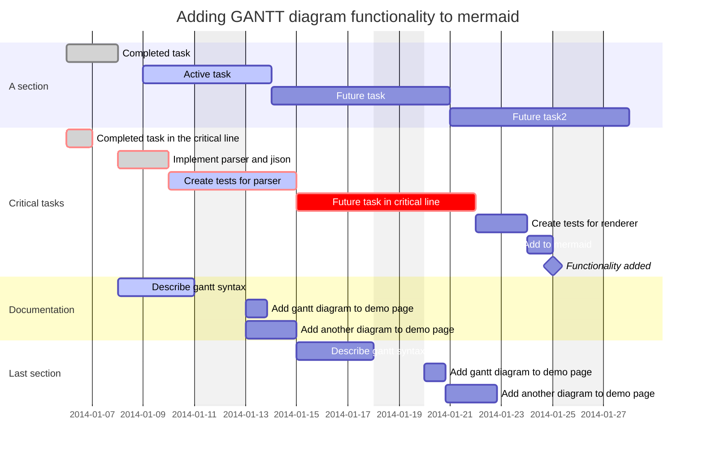
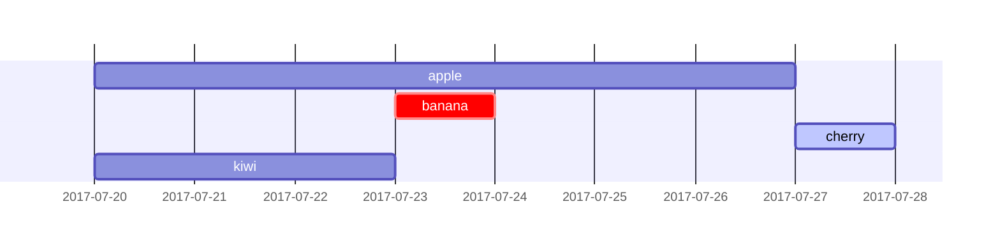
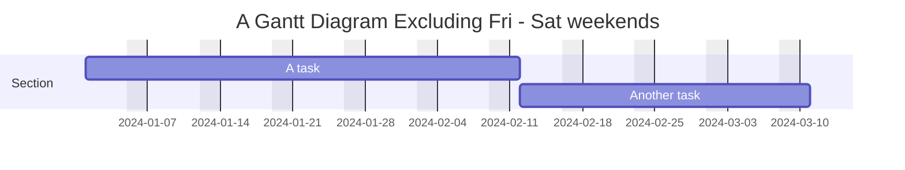
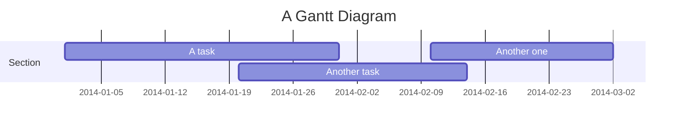
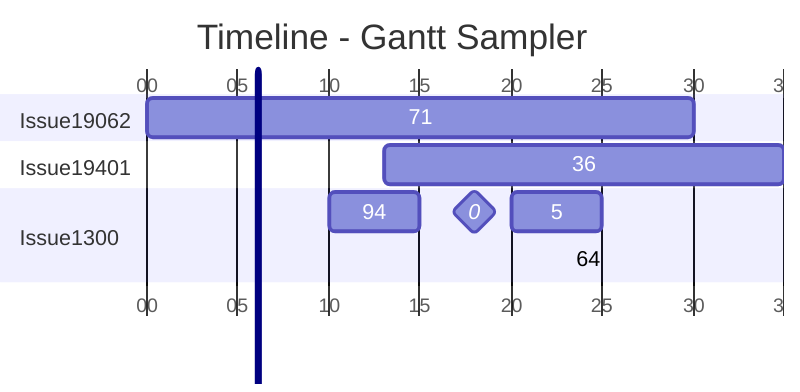

# Gantt

```mermaid
gantt
    dateFormat HH:mm
    axisFormat %H:%M
    Initial milestone : milestone, m1, 17:49, 2m
    Task A : 10m
    Task B : 5m
    Final milestone : milestone, m2, 18:08, 4m
```

```mermaid
gantt
    dateFormat HH:mm
    axisFormat %H:%M
    Initial vert : vert, v1, 17:30, 2m
    Task A : 3m
    Task B : 8m
    Final vert : vert, v2, 17:58, 4m
```

As tarefas são sequenciais por padrão.
A data de início de uma tarefa é, por padrão, a data de término da tarefa anterior.

Dois pontos `:`, separam o título da tarefa de seus metadados.
Os itens de metadados são separados por uma vírgula, `,`.
As tags válidas são `active`, `done`, `crit` e `milestone`.
As tags são opcionais e se usadas devem ser especificadas primeiro.

Após o processamento das tags, os itens de metadados restantes são interpretados da seguinte forma:

1. Se um único item for especificado, ele determina quando a tarefa termina. Pode ser uma data/hora específica ou uma duração. Se uma duração for especificada, ela será adicionada à data de início da tarefa para determinar a data de término da tarefa, levando em consideração quaisquer exclusões.
2. Se dois itens forem especificados, o último item será interpretado como no caso anterior. O primeiro item pode especificar uma data/hora de início explícita (no formato especificado por dateFormat) ou referenciar outra tarefa usando after `<otherTaskID>` `[[otherTaskID2 [otherTaskID3]]...]`. Neste último caso, a data de início da tarefa será definida de acordo com a data de término mais recente de qualquer tarefa referenciada.
3. Se três itens forem especificados, os dois últimos serão interpretados como no caso anterior. O primeiro item denotará o ID da tarefa, que pode ser referenciado usando a sintaxe `<taskID>` posterior.

| Metadata syntax                                      | Start date                                                         | End date                                                          | ID     |
| ---------------------------------------------------- | ------------------------------------------------------------------ | ----------------------------------------------------------------- | ------ |
| `<taskID>, <startDate>, <length>`                    | `startdate` conforme interpretado usando o formato de data         | `startdate` + `length`                                            | taskID |
| `<taskID>, <startDate>, <endDate>`                   | `startdate` conforme interpretado usando o formato de data         | `endDate` conforme interpretado usando o formato de data          | taskID |
| `<taskID>, <startDate>, until <otherTaskId>`         | `startdate` conforme interpretado usando o formato de data         | Data de início da tarefa `otherTaskID` especificada anteriormente | taskID |
| `<taskID>, after <otherTaskId>, <length>`            | Data de término da tarefa `otherTaskID` especificada anteriormente | `startdate` + `length`                                            | taskID |
| `<taskID>, after <otherTaskId>, <endDate>`           | Data de término da tarefa `otherTaskID` especificada anteriormente | `endDate` conforme interpretado usando o formato de data          | taskID |
| `<taskID>, after <otherTaskId>, until <otherTaskId>` | Data de término da tarefa `otherTaskID` especificada anteriormente | Data de início da tarefa `otherTaskID` especificada anteriormente | taskID |
| `<startDate>, <length>`                              | `startdate` conforme interpretado usando o formato de data         | `startdate` + `length`                                            | n/a    |
| `<startDate>, <endDate>`                             | `startdate` conforme interpretado usando o formato de data         | `endDate` conforme interpretado usando o formato de data          | n/a    |
| `after <otherTaskID>, <length>`                      | Data de término da tarefa `otherTaskID` especificada anteriormente | `startdate` + `length`                                            | n/a    |
| `after <otherTaskID>, <endDate>`                     | Data de término da tarefa `otherTaskID` especificada anteriormente | `endDate` conforme interpretado usando o formato de data          | n/a    |
| `<startDate>, until <otherTaskId>`                   | `startdate` conforme interpretado usando o formato de data         | Data de início da tarefa `otherTaskID` especificada anteriormente | n/a    |
| `after <otherTaskId>, until <otherTaskId>`           | Data de término da tarefa `otherTaskID` especificada anteriormente | Data de início da tarefa `otherTaskID` especificada anteriormente | n/a    |
| `<length>`                                           | Data de término da tarefa anterior                                 | `startdate` + `length`                                            | n/a    |
| `<endDate>`                                          | Data de término da tarefa anterior                                 | `endDate` conforme interpretado usando o formato de data          | n/a    |
| `until <otherTaskId>`                                | Data de término da tarefa anterior                                 | Data de início da tarefa `otherTaskID` especificada anteriormente | n/a    |

!!! info
    O suporte para a palavra-chave until foi adicionado na versão 10.9.0+. Isso pode ser usado para definir uma tarefa que permanece em execução até que outra tarefa ou marco específico seja iniciado.

## As seguintes opções de formatação são suportadas

| Entrada    | Exemplo        | Descrição                                                        |
| ---------- | -------------- | ---------------------------------------------------------------- |
| `AAAA`     | 2014           | Ano com 4 dígitos                                                |
| `AA`       | 14             | Ano com 2 dígitos                                                |
| `Q`        | 1..4           | Trimestre do ano. Define o mês como o primeiro mês do trimestre. |
| `M MM`     | 1..12          | Número do mês                                                    |
| `MMM MMMM` | Janeiro..Dez   | Nome do mês na localidade definida por `dayjs.locale()`          |
| `D DD`     | 1..31          | Dia do mês                                                       |
| `Do`       | 1..31          | Dia do mês com ordinal                                           |
| `DDD DDDD` | 1..365         | Dia do ano                                                       |
| `X`        | 1410715640.579 | Carimbo de data e hora Unix                                      |
| `x`        | 1410715640579  | Carimbo de data e hora Unix ms                                   |
| `H HH`     | 0..23          | Horário de 24 horas                                              |
| `h hh`     | 1..12          | Horário de 12 horas usado com `a A`.                             |
| `a A`      | am pm          | Post or ante meridiem                                            |
| `m mm`     | 0..59          | Minutos                                                          |
| `s ss`     | 0..59          | Segundos                                                         |
| `S`        | 0..9           | Décimos de segundo                                               |
| `SS`       | 0..99          | Centenas de segundo                                              |
| `SSS`      | 0..999         | Milésimos de segundo                                             |
| `Z ZZ`     | +12:00         | Deslocamento do UTC como +-HH:mm, +-HHmm ou Z                    |

More info in: <https://day.js.org/docs/en/parse/string-format/>

## The following formatting strings are supported

| Formato | Definição                                                                                              |
| ------- | ------------------------------------------------------------------------------------------------------ |
| `%a`    | nome abreviado do dia da semana                                                                        |
| `%A`    | nome completo do dia da semana                                                                         |
| `%b`    | nome abreviado do mês                                                                                  |
| `%B`    | nome completo do mês                                                                                   |
| `%c`    | data e hora, como `%a %b %e %H:%M:%S %Y`                                                               |
| `%d`    | dia do mês preenchido com zeros como um número decimal `[01,31]`                                       |
| `%e`    | dia do mês preenchido com espaços como um número decimal `[ 1,31]`; equivalente a `%_d`                |
| `%H`    | hora (relógio de 24 horas) como um número decimal `[00,23]`                                            |
| `%I`    | hora (relógio de 12 horas) como um número decimal `[01,12]`                                            |
| `%j`    | dia do ano como um número decimal `[001,366]`                                                          |
| `%m`    | mês como um número decimal `[01,12]`                                                                   |
| `%M`    | minuto como um número decimal `[00,59]`                                                                |
| `%L`    | milissegundos como um número decimal `[000, 999]`                                                      |
| `%p`    | `AM` ou `PM`                                                                                           |
| `%S`    | segundo como um número decimal `[00,61]`                                                               |
| `%U`    | número da semana do ano (domingo como o primeiro dia da semana) como um número decimal `[00,53]`       |
| `%w`    | dia da semana como um número decimal `[0(domingo),6]`                                                  |
| `%W`    | número da semana do ano (segunda-feira como o primeiro dia da semana) como um número decimal `[00,53]` |
| `%x`    | data, como `%m/%d/%Y`                                                                                  |
| `%X`    | hora, como `%H:%M:%S`                                                                                  |
| `%y`    | ano sem século como número decimal `[00,99]`                                                           |
| `%Y`    | ano com século como número decimal                                                                     |
| `%Z`    | deslocamento de fuso horário, como `-0700`                                                             |
| `%%`    | um caractere literal `%`                                                                               |

Mais informações em: [https://github.com/d3/d3-time-format/tree/v4.0.0#locale\_format](https://github.com/d3/d3-time-format/tree/v4.0.0#locale_format)

## Classes used

| Classe                  | Descrição                                                                   |
| ----------------------- | --------------------------------------------------------------------------- |
| `grid.tick`             | Estilo das Linhas da Grade                                                  |
| `grid.path`             | Estilo das Bordas da Grade                                                  |
| `.taskText`             | Estilo do Texto da Tarefa                                                   |
| `.taskTextOutsideRight` | Estilo do Texto da Tarefa que excede a barra de atividades para a direita   |
| `.taskTextOutsideLeft`  | Estilo do Texto da Tarefa que excede a barra de atividades, para a esquerda |
| `todayMarker`           | Alternância e Estilo do `Marcador de Hoje`                                  |

## Possible configuration params

| Parâmetro       | Descrição                                                                                                                                                    | Valor padrão |
| --------------- | ------------------------------------------------------------------------------------------------------------------------------------------------------------ | ------------ |
| mirrorActor     | Liga/desliga a renderização dos atores abaixo e acima do diagrama                                                                                            | false        |
| bottomMarginAdj | Ajusta a profundidade do gráfico. Estilos de bordas largas com CSS podem gerar recortes indesejados, e é por isso que este parâmetro de configuração existe. | 1            |
