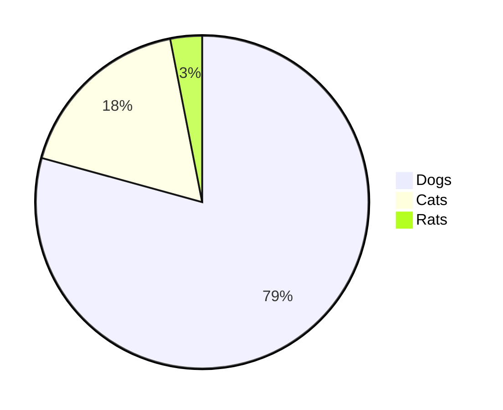

# Pie

```mermaid
pie

"Dogs" : 386
"Cats" : 85.9
"Rats" : 15
```

```mermaid
pie showdata
    title Distribuição de Peças
    "OK" : 387
    "Não OK" : 56
%%{
    init: {
        "theme":"default",
        "pie": {
            "textPosition": 0.9
        }, 
        "themeVariables": {
            "pieOpacity": "0.8",

            "pieTitleTextSize": "40px",
            "pieTitleTextColor": "#FF0000",

            "pieStrokeWidth": "1px",
            "pieStrokeColor": "#00000044",

            "pieOuterStrokeWidth": "5px",
            "pieOuterStrokeColor": "#FF000031",

            "pieLegendTextSize": "10px",
            "pieLegendTextColor": "#0f0",

            "pieSectionTextSize": "15px",
            "pieSectionTextColor": "#0000FF",

            "pie1": "#FF0000",
            "pie2": "#0FF000"
        }
    } 
}%%
```
