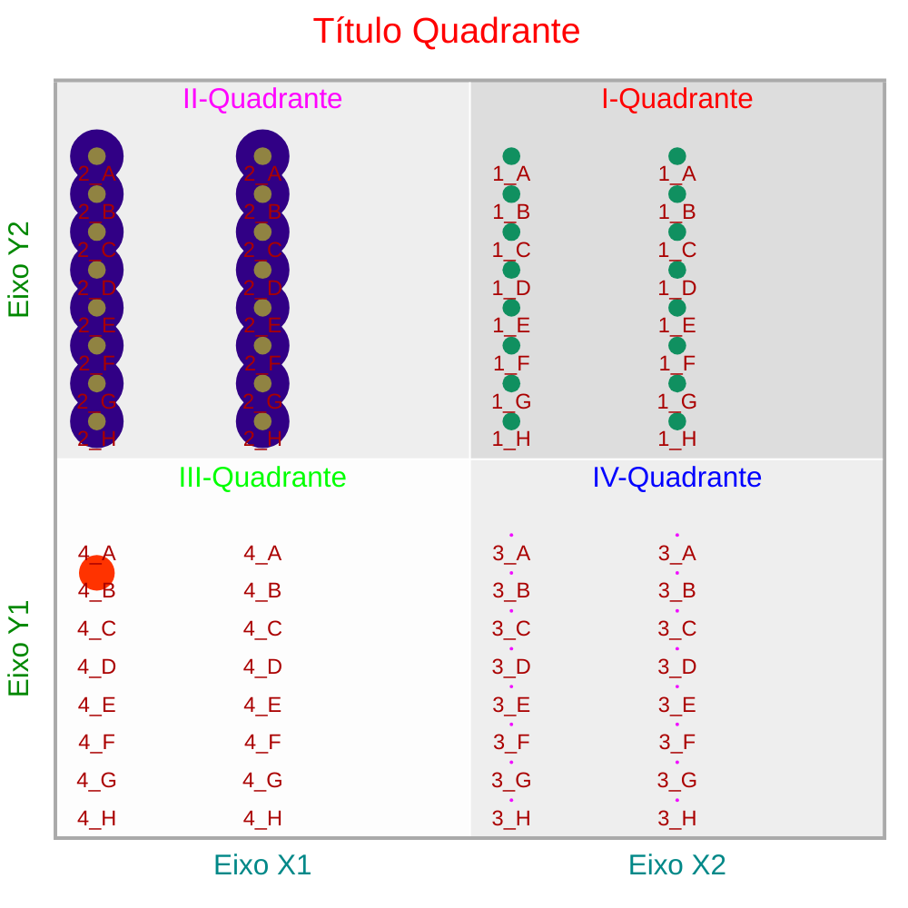
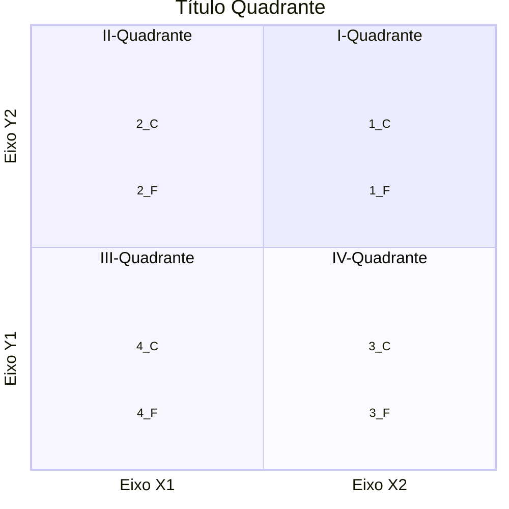

# Quadrant

https://mermaid.js.org/syntax/quadrantChart.html

```mermaid
quadrantChart
    title Título Quadrante

    x-axis "Eixo X1" --> "Eixo X2"
    y-axis "Eixo Y1" --> "Eixo Y2"

    quadrant-1 "I-Quadrante"
    quadrant-2 "II-Quadrante"
    quadrant-3 "III-Quadrante"
    quadrant-4 "IV-Quadrante"

    %% quadrant-1 %%
        "1_A":::class1: [0.55, 0.90]
        "1_B":::class1: [0.55, 0.85]
        "1_C":::class1: [0.55, 0.80]
        "1_D":::class1: [0.55, 0.75]
        "1_E":::class1: [0.55, 0.70]
        "1_F":::class1: [0.55, 0.65]
        "1_G":::class1: [0.55, 0.60]
        "1_H":::class1: [0.55, 0.55]

        "1_A":::class1: [0.75, 0.90]
        "1_B":::class1: [0.75, 0.85]
        "1_C":::class1: [0.75, 0.80]
        "1_D":::class1: [0.75, 0.75]
        "1_E":::class1: [0.75, 0.70]
        "1_F":::class1: [0.75, 0.65]
        "1_G":::class1: [0.75, 0.60]
        "1_H":::class1: [0.75, 0.55]
    %% quadrant-2 %%
        "2_A":::class2: [0.05, 0.90]
        "2_B":::class2: [0.05, 0.85]
        "2_C":::class2: [0.05, 0.80]
        "2_D":::class2: [0.05, 0.75]
        "2_E":::class2: [0.05, 0.70]
        "2_F":::class2: [0.05, 0.65]
        "2_G":::class2: [0.05, 0.60]
        "2_H":::class2: [0.05, 0.55]

        "2_A":::class2: [0.25, 0.90]
        "2_B":::class2: [0.25, 0.85]
        "2_C":::class2: [0.25, 0.80]
        "2_D":::class2: [0.25, 0.75]
        "2_E":::class2: [0.25, 0.70]
        "2_F":::class2: [0.25, 0.65]
        "2_G":::class2: [0.25, 0.60]
        "2_H":::class2: [0.25, 0.55]
    %% quadrant-3 %%
        "3_A":::class3: [0.55, 0.40]
        "3_B":::class3: [0.55, 0.35]
        "3_C":::class3: [0.55, 0.30]
        "3_D":::class3: [0.55, 0.25]
        "3_E":::class3: [0.55, 0.20]
        "3_F":::class3: [0.55, 0.15]
        "3_G":::class3: [0.55, 0.10]
        "3_H":::class3: [0.55, 0.05]

        "3_A":::class3: [0.75, 0.40]
        "3_B":::class3: [0.75, 0.35]
        "3_C":::class3: [0.75, 0.30]
        "3_D":::class3: [0.75, 0.25]
        "3_E":::class3: [0.75, 0.20]
        "3_F":::class3: [0.75, 0.15]
        "3_G":::class3: [0.75, 0.10]
        "3_H":::class3: [0.75, 0.05]
    %% quadrant-4 %%
        "4_A":::class4: [0.05, 0.40]
        "4_B":::class4: [0.05, 0.35] color: #ff3300, radius: 10
        "4_C":::class4: [0.05, 0.30]
        "4_D":::class4: [0.05, 0.25]
        "4_E":::class4: [0.05, 0.20]
        "4_F":::class4: [0.05, 0.15]
        "4_G":::class4: [0.05, 0.10]
        "4_H":::class4: [0.05, 0.05]

        "4_A":::class4: [0.25, 0.40]
        "4_B":::class4: [0.25, 0.35]
        "4_C":::class4: [0.25, 0.30]
        "4_D":::class4: [0.25, 0.25]
        "4_E":::class4: [0.25, 0.20]
        "4_F":::class4: [0.25, 0.15]
        "4_G":::class4: [0.25, 0.10]
        "4_H":::class4: [0.25, 0.05]
    %% classes %%
        classDef class1 color: #109060
        classDef class2 color: #908342, radius : 10, stroke-color: #310085, stroke-width: 10px
        classDef class3 color: #f00fff, radius : 1
        classDef class4 color: #f00fff, radius : 0

    %%{
        init: {
            "quadrantChart": {
                "chartWidth": 500,
                "chartHeight": 500,
                "titlePadding": 10,
                "titleFontSize": 20,
                "quadrantPadding": 5,
                "quadrantTextTopPadding": 5,
                "quadrantLabelFontSize": 16,
                "quadrantInternalBorderStrokeWidth": 1,
                "quadrantExternalBorderStrokeWidth": 2,
                "xAxisLabelPadding": 5,
                "xAxisLabelFontSize": 16,
                "xAxisPosition": "top",
                "yAxisLabelPadding": 5,
                "yAxisLabelFontSize": 16,
                "yAxisPosition": "left",
                "pointTextPadding": 5,
                "pointLabelFontSize": 12,
                "pointRadius": 5
            }, 
            "themeVariables": {
                "quadrantTitleFill": "#f00",
                "quadrantPointTextFill": "#A00",
                "quadrantPointFill": "#aaa",
                "quadrantXAxisTextFill": "#088",
                "quadrantYAxisTextFill": "#080",
                "quadrantInternalBorderStrokeFill": "#FFF",
                "quadrantExternalBorderStrokeFill": "#AAA",

                "quadrant1TextFill": "#f00",
                "quadrant1Fill": "#ddd",

                "quadrant2TextFill": "#f0f",
                "quadrant2Fill": "#eee",

                "quadrant3TextFill": "#0f0",
                "quadrant3Fill": "#fdfdfd",

                "quadrant4TextFill": "#00f",
                "quadrant4Fill": "#eee"
            }
        }
    }%%
```

```mermaid
quadrantChart
    title Título Quadrante

    x-axis "Eixo X1" --> "Eixo X2"
    y-axis "Eixo Y1" --> "Eixo Y2"

    quadrant-1 "I-Quadrante"
    quadrant-2 "II-Quadrante"
    quadrant-3 "III-Quadrante"
    quadrant-4 "IV-Quadrante"

    %% quadrant-1 %%
        "1_C":::class1: [0.75, 0.80]
        "1_F":::class1: [0.75, 0.65]
    %% quadrant-2 %%
        "2_C":::class2: [0.25, 0.80]
        "2_F":::class2: [0.25, 0.65]
    %% quadrant-3 %%
        "3_C":::class3: [0.75, 0.30]
        "3_F":::class3: [0.75, 0.15]
    %% quadrant-4 %%
        "4_C":::class4: [0.25, 0.30]
        "4_F":::class4: [0.25, 0.15]

    %%{
        init: {
            "quadrantChart": {
                "titlePadding": 0,
                "pointRadius": 0
            }
        }
    }%%
```

