# Sequence Diagram

[https://mermaid.js.org/syntax/sequenceDiagram.html](https://mermaid.js.org/syntax/sequenceDiagram.html)

## Messages

\[Actor/Participant\]\[Arrow\]\[Actor/Participant\]:Message text

## Links

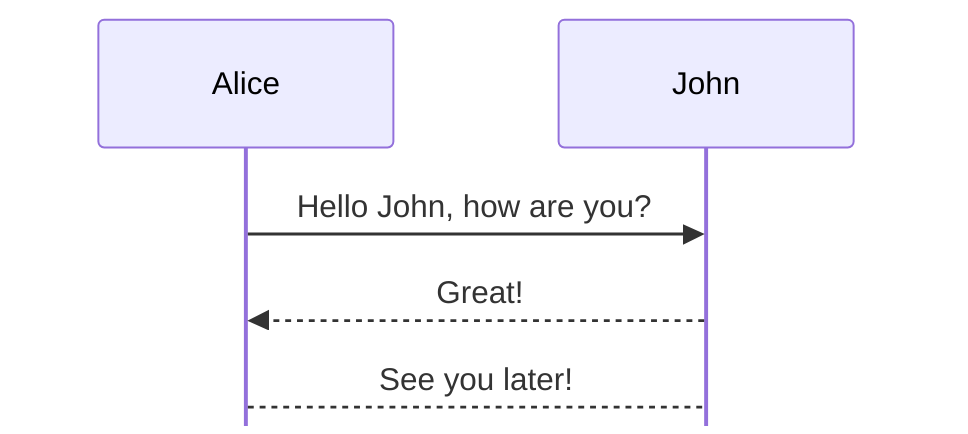
```mermaid
sequenceDiagram

Alice->>John: Hello John, how are you?
John-->>Alice: Great!
Alice-->John: See you later!
%%{
  init: {
    "sequence": {
      "mirrorActors": false
    }
  }
}%%
```

## Participants

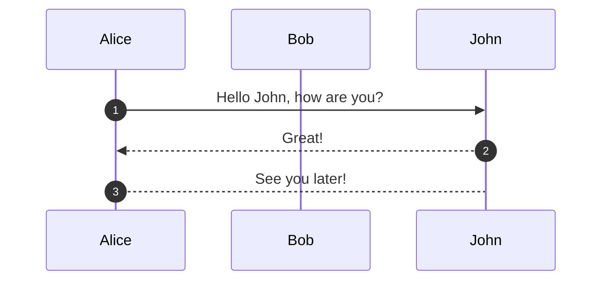
```mermaid
sequenceDiagram

    autonumber
    participant Alice
    participant Bob
    participant John
    Alice->>John: Hello John, how are you?
    John-->>Alice: Great!
    Alice-->John: See you later!
```

## Actors

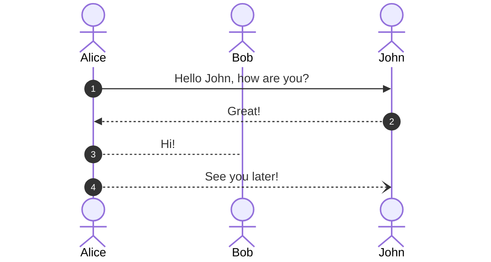
```mermaid
sequenceDiagram

    autonumber
    actor Alice
    actor Bob
    actor John
    Alice->>John: Hello John, how are you?
    John-->>Alice: Great!
    Alice-->Bob: Hi!
    Alice--)John: See you later!
```

## Alias

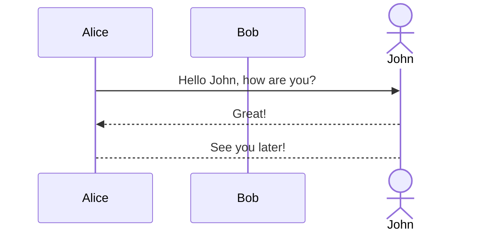
```mermaid
sequenceDiagram

participant A as Alice
participant B as Bob
actor J as John

A->>J: Hello John, how are you?
J-->>A: Great!
A-->J: See you later!
```

## Arrows

| Type | Description                                      |
| ---- | ------------------------------------------------ |
| ->   | Solid line without arrow                         |
| -->  | Dotted line without arrow                        |
| ->>  | Solid line with arrowhead                        |
| -->> | Dotted line with arrowhead                       |
| -x   | Solid line with a cross at the end               |
| --x  | Dotted line with a cross at the end              |
| -)   | Solid line with an open arrow at the end (async) |
| --)  | Dotted line with a open arrow at the end (async) |

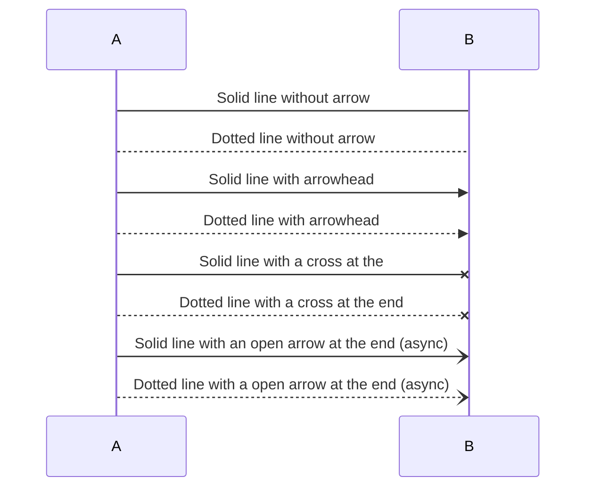
```mermaid
sequenceDiagram

A ->   B: Solid line without arrow
A -->  B: Dotted line without arrow
A ->>  B: Solid line with arrowhead
A -->> B: Dotted line with arrowhead
A -x   B: Solid line with a cross at the
A --x  B: Dotted line with a cross at the end
A -)   B: Solid line with an open arrow at the end (async)
A --)  B: Dotted line with a open arrow at the end (async)
```

## Activations

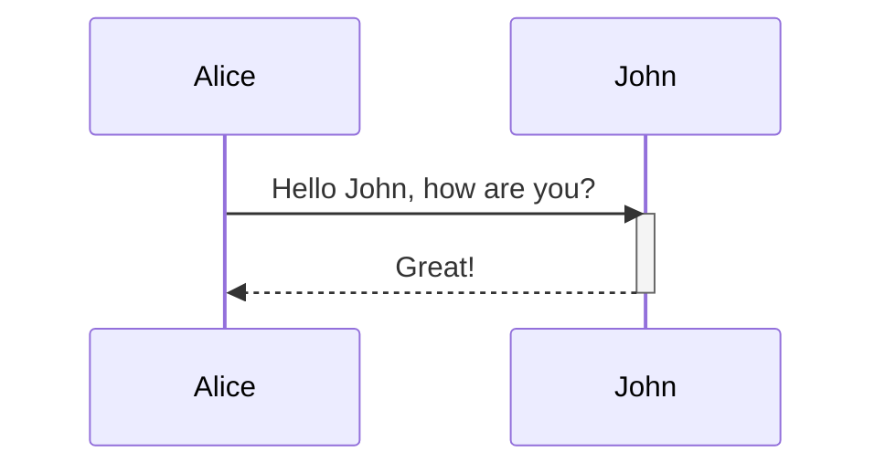
```mermaid
sequenceDiagram
    Alice->>John: Hello John, how are you?
    activate John
    John-->>Alice: Great!
    deactivate John

```

other way

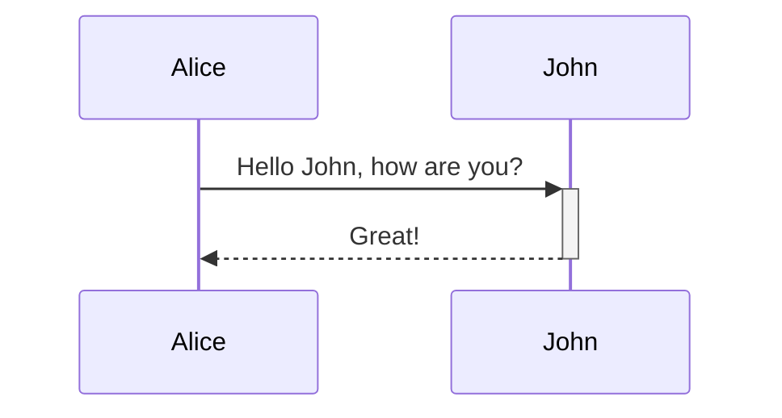
```mermaid
sequenceDiagram
    Alice->>+John: Hello John, how are you?
    John-->>-Alice: Great!
```

blending

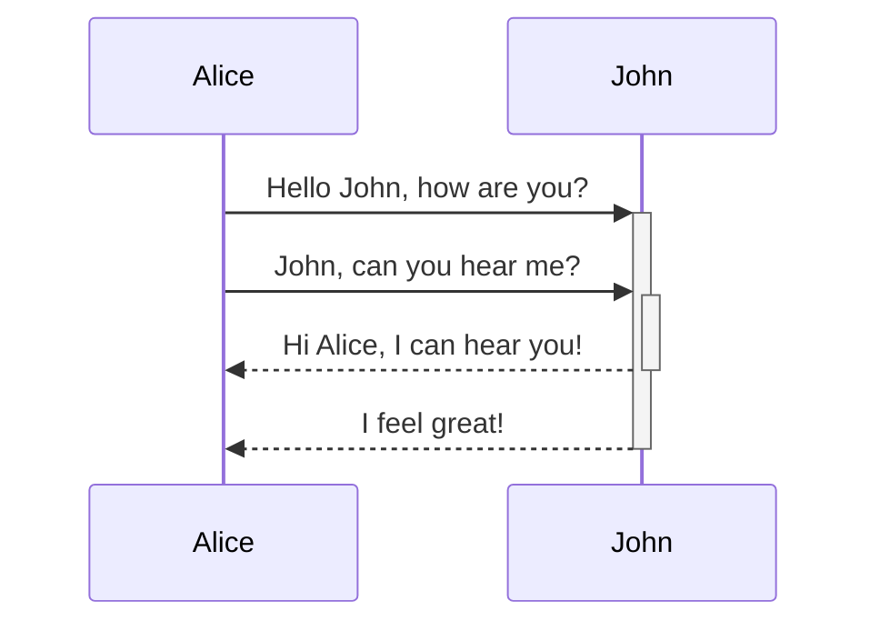
```mermaid
sequenceDiagram
    Alice->>+John: Hello John, how are you?
    Alice->>+John: John, can you hear me?
    John-->>-Alice: Hi Alice, I can hear you!
    John-->>-Alice: I feel great!
```

## Notes

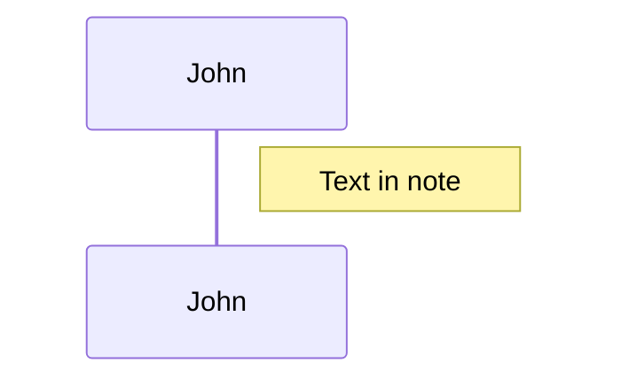
```mermaid
sequenceDiagram
    participant John
    Note right of John: Text in note
```

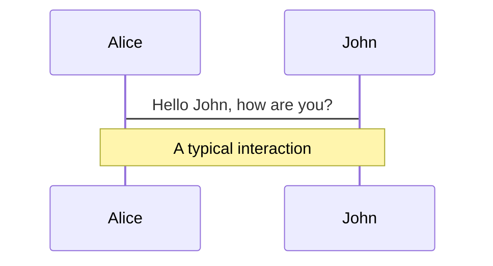
```mermaid
sequenceDiagram
    Alice->John: Hello John, how are you?
    Note over Alice,John: A typical interaction
```

## Loops

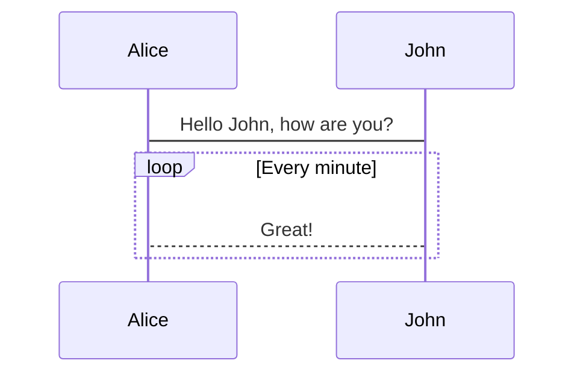
```mermaid
sequenceDiagram
    Alice->John: Hello John, how are you?
    loop Every minute
        John-->Alice: Great!
    end
```

## Alt

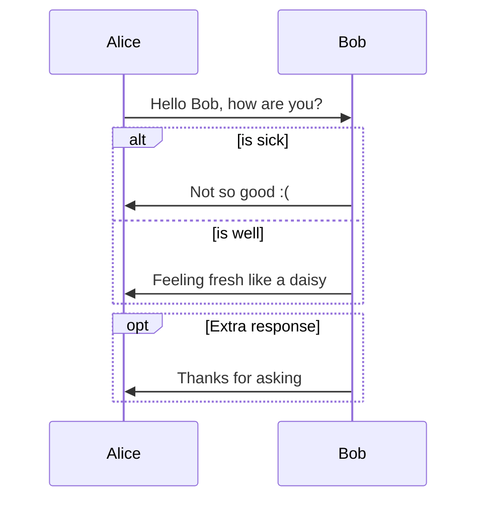
```mermaid
sequenceDiagram
    Alice->>Bob: Hello Bob, how are you?
    alt is sick
        Bob->>Alice: Not so good :(
    else is well
        Bob->>Alice: Feeling fresh like a daisy
    end
    opt Extra response
        Bob->>Alice: Thanks for asking
    end

```

## Parallel

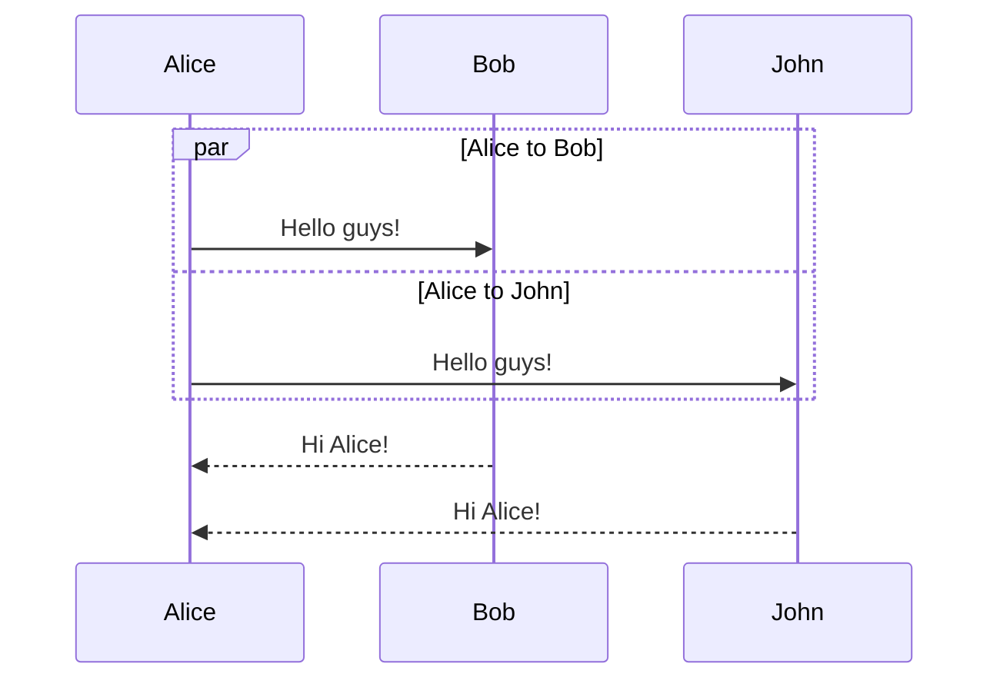
```mermaid
sequenceDiagram
    par Alice to Bob
        Alice->>Bob: Hello guys!
    and Alice to John
        Alice->>John: Hello guys!
    end
    Bob-->>Alice: Hi Alice!
    John-->>Alice: Hi Alice!
```

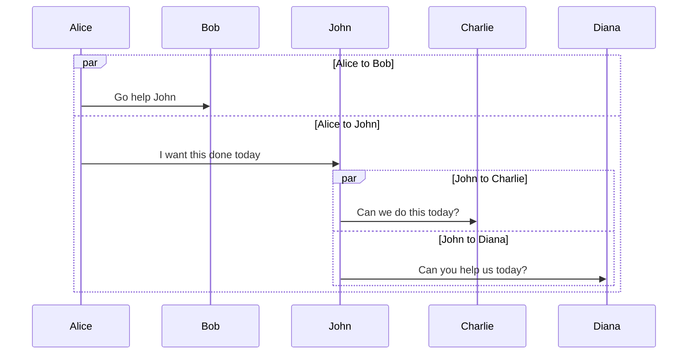
```mermaid
sequenceDiagram
    par Alice to Bob
        Alice->>Bob: Go help John
    and Alice to John
        Alice->>John: I want this done today
        par John to Charlie
            John->>Charlie: Can we do this today?
        and John to Diana
            John->>Diana: Can you help us today?
        end
    end
```

## Critical Region

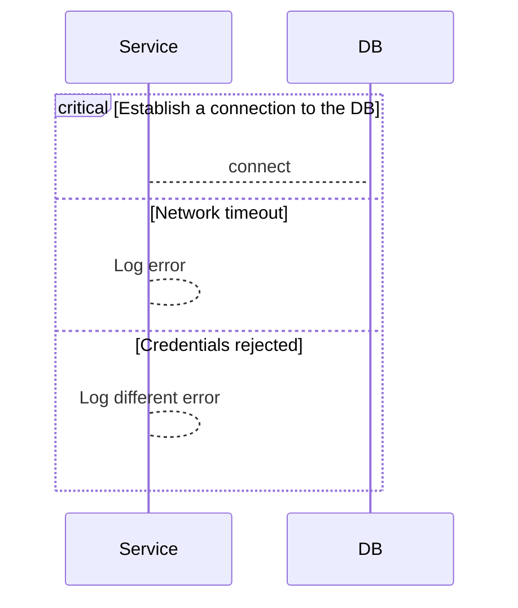
```mermaid
sequenceDiagram
    critical Establish a connection to the DB
        Service-->DB: connect
    option Network timeout
        Service-->Service: Log error
    option Credentials rejected
        Service-->Service: Log different error
    end
```

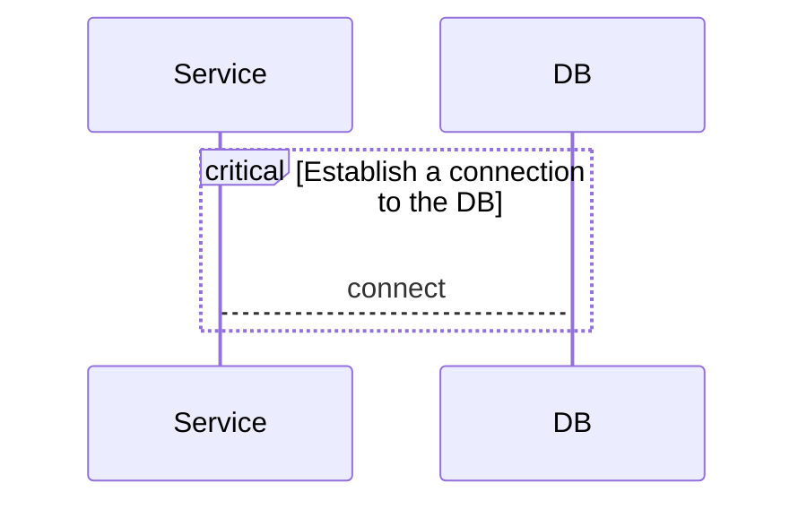
```mermaid
sequenceDiagram
    critical Establish a connection to the DB
        Service-->DB: connect
    end
```

## Break

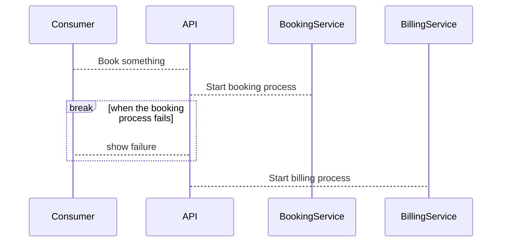
```mermaid
sequenceDiagram
    Consumer-->API: Book something
    API-->BookingService: Start booking process
    break when the booking process fails
        API-->Consumer: show failure
    end
    API-->BillingService: Start billing process
```

## Background Highlighting

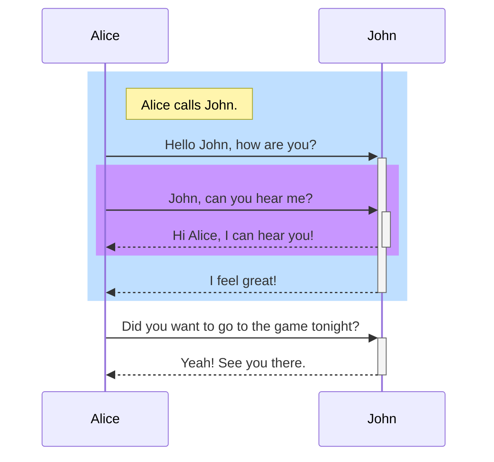
```mermaid
sequenceDiagram
    participant Alice
    participant John

    rect rgb(191, 223, 255)
    note right of Alice: Alice calls John.
    Alice->>+John: Hello John, how are you?
    rect rgb(200, 150, 255)
    Alice->>+John: John, can you hear me?
    John-->>-Alice: Hi Alice, I can hear you!
    end
    John-->>-Alice: I feel great!
    end
    Alice ->>+ John: Did you want to go to the game tonight?
    John -->>- Alice: Yeah! See you there.
```

## Escape characters

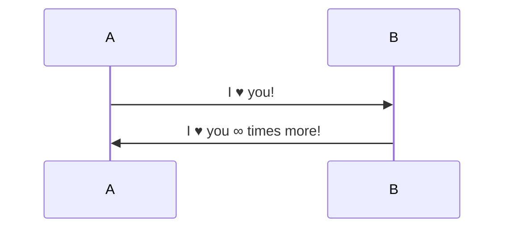
```mermaid
sequenceDiagram
    A->>B: I #9829; you!
    B->>A: I #9829; you #infin; times more!
```

## sequenceNumbers

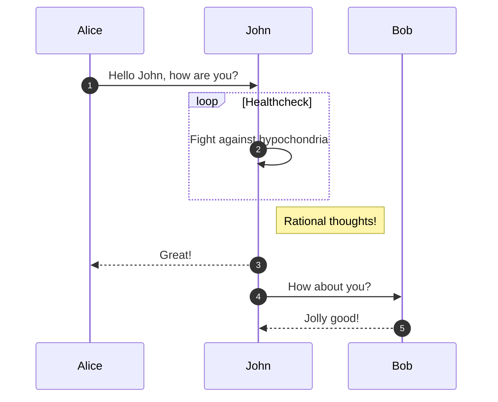
```mermaid
sequenceDiagram
    autonumber
    Alice->>John: Hello John, how are you?
    loop Healthcheck
        John->>John: Fight against hypochondria
    end
    Note right of John: Rational thoughts!
    John-->>Alice: Great!
    John->>Bob: How about you?
    Bob-->>John: Jolly good!

```

## Actor Menus

```mermaid
sequenceDiagram
    participant Alice
    participant John
    link Alice: Dashboard @ https://dashboard.contoso.com/alice
    link Alice: Wiki @ https://wiki.contoso.com/alice
    link John: Dashboard @ https://dashboard.contoso.com/john
    link John: Wiki @ https://wiki.contoso.com/john
    Alice->>John: Hello John, how are you?
    John-->>Alice: Great!
    Alice-)John: See you later!
```

```mermaid
sequenceDiagram
    participant Alice
    participant John
    links Alice: {"Dashboard": "https://dashboard.contoso.com/alice", "Wiki": "https://wiki.contoso.com/alice"}
    links John: {"Dashboard": "https://dashboard.contoso.com/john", "Wiki": "https://wiki.contoso.com/john"}
    Alice->>John: Hello John, how are you?
    John-->>Alice: Great!
    Alice-)John: See you later!
```

## Example

```mermaid
sequenceDiagram

Alice->>John: Hello John, how are you?
loop Healthcheck
    John->>John: Fight against hypochondria
end
Note right of John: Rational thoughts!
John-->>Alice: Great!
John->>Bob: How about you?
Bob-->>John: Jolly good!
```
