# State Diagram-v2

## Examples

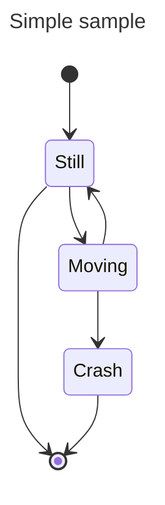

## States

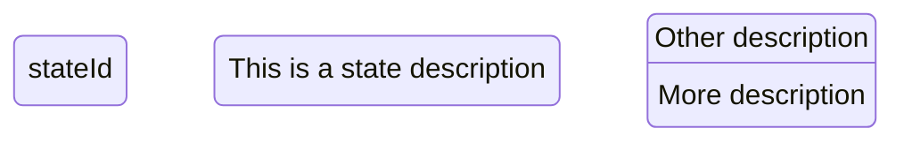

## Transitions

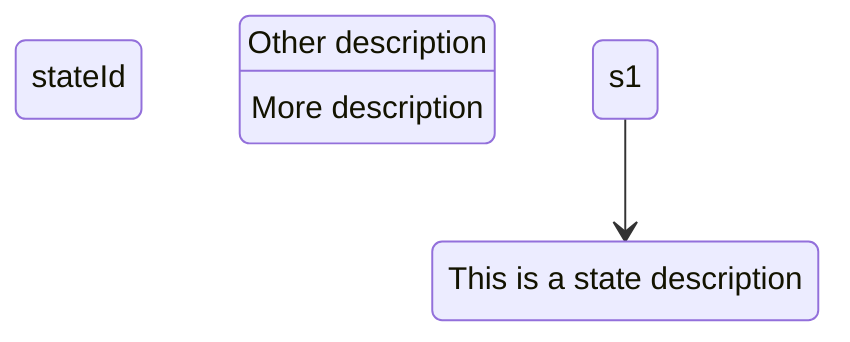

## Start and End

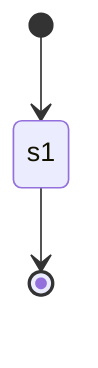

## Composite states

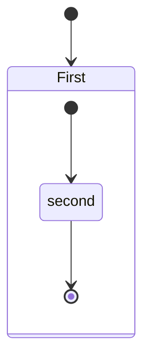

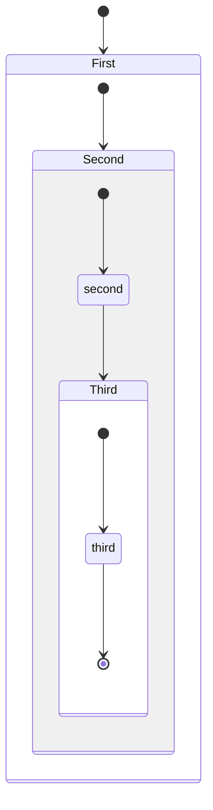

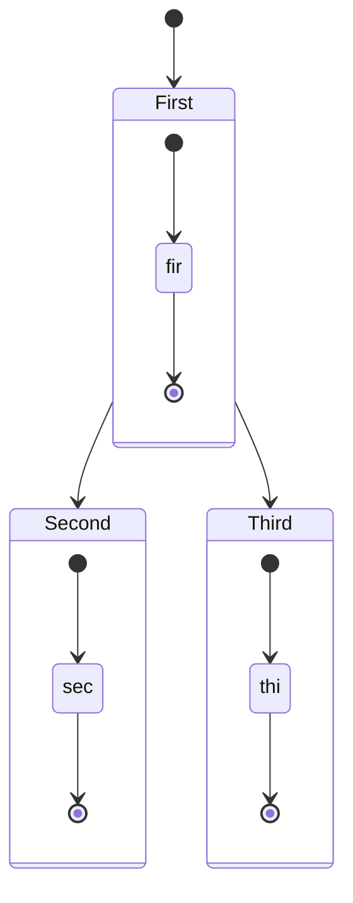

## Choice

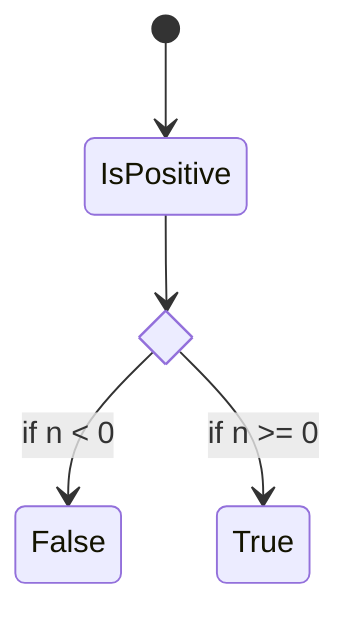

## Forks

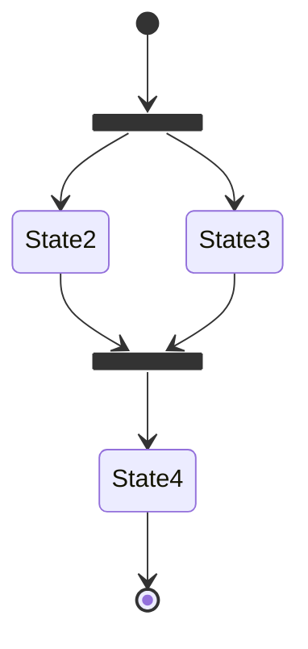

## Notes

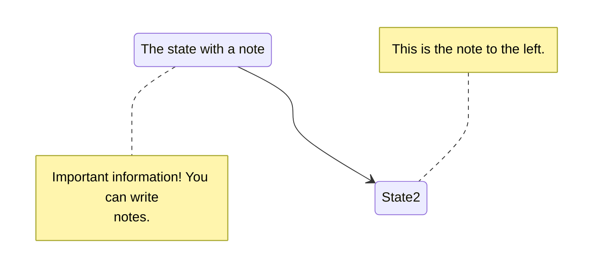

## Concurrency

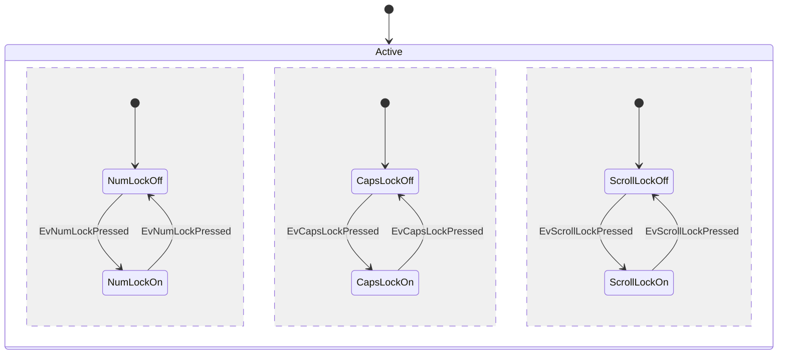

## Setting the direction of the diagram

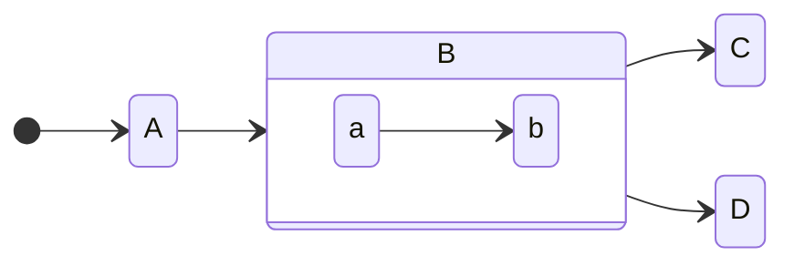

## Styling with classDefs

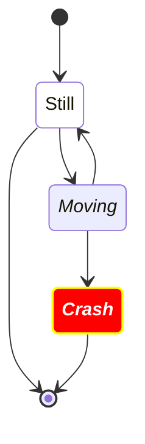

## Spaces in state names

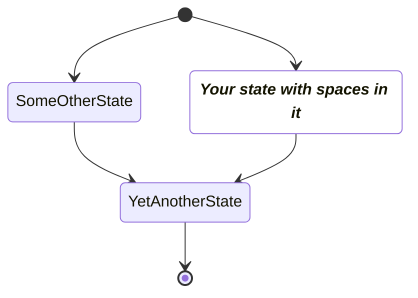
