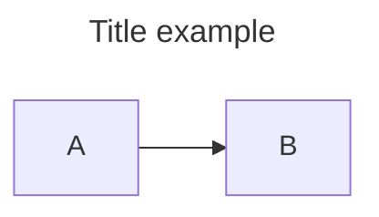

# MerMaid Extension

## Refer

- <https://github.com/mermaid-js/mermaid>
- <https://mermaid.js.org/intro/>
- <https://www.mermaidchart.com/app/projects/>

## Links

- [Flowchart](Flowchart.md)
- [Sequence Diagram](Sequence_Diagram.md)
- [Class Diagram](Class_Diagram.md)
- [State Diagram](State_Diagram.md)
- [Entity Relationship Diagram](Entity_Diagram.md)
- [User Journey Diagram](Journey.md)
- [Requirement Diagram](Requirement_Diagram.md)
- [Gantt](Gantt.md)
- [Pie Chart](Pie.md)
- [Git Graph Diagram](Git_Graph.md)
- [Graph](Graph.md)
- [C4C Diagram (Context)](C4C.md)
- [Mindmap](Mindmap.md)

## Title

## Directions

- TB - top to bottom
- TD - top-down/ same as top to bottom
- BT - bottom to top
- RL - right to left
- LR - left to right
