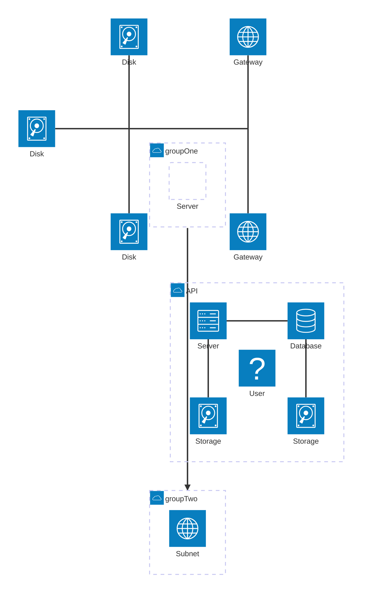

# Arquiteture

```mermaid
architecture-beta
%% service {service id}({icon name})[{title}] (in {parent id})?
%% {serviceId}{{group}}?:{T|B|L|R} {<}?--{>}? {T|B|L|R}:{serviceId}{{group}}?
    %% group api(logos:aws-lambda)[API]
    group api(cloud)[API]

    service db(database)[Database] in api
    service disk1(disk)[Storage] in api
    service disk2(disk)[Storage] in api
    service server(server)[Server] in api
    service user(user)[User] in api

    db:L -- R:server
    disk1:T -- B:server
    disk2:T -- B:db
%% groups, services, edges, and junctions
    service left_disk(disk)[Disk]
    service top_disk(disk)[Disk]
    service bottom_disk(disk)[Disk]
    service top_gateway(internet)[Gateway]
    service bottom_gateway(internet)[Gateway]
    junction junctionCenter
    junction junctionRight

    left_disk:R -- L:junctionCenter
    top_disk:B -- T:junctionCenter
    bottom_disk:T -- B:junctionCenter
    junctionCenter:R -- L:junctionRight
    top_gateway:B -- T:junctionRight
    bottom_gateway:T -- B:junctionRight

    group groupOne(cloud)[groupOne]
    group groupTwo(cloud)[groupTwo]

    service server1[Server] in groupOne
    service subnet1(internet)[Subnet] in groupTwo

    server1{group}:B --> T:subnet1{group}
```
