# Túneis de Rede (Network Tunneling)

- [SSH](SSH.md)

## Conceito

**Tunelamento de rede (Network Tunneling)*- é uma técnica que permite encapsular um tipo de tráfego de rede dentro de outro protocolo, criando um **“canal lógico”*- entre dois pontos. Esse canal possibilita que dados trafeguem de forma **segura**, **transparente*- ou **controlada**, mesmo através de redes não confiáveis ou restritas.

Em termos simples, um túnel funciona como um **“tubo virtual”**:
o tráfego original entra em uma extremidade, é encapsulado, transportado pela rede intermediária e depois desencapsulado no destino, como se os dois pontos estivessem diretamente conectados.

Os túneis são amplamente utilizados para:

- Segurança e criptografia de dados
- Acesso remoto
- Bypass de restrições de rede
- Integração entre redes privadas
- Exposição controlada de serviços internos
- Observabilidade, testes e debugging

## Funcionamento Geral do Tunelamento

O processo de tunelamento envolve, em geral, quatro etapas:

1. **Encapsulamento*- do tráfego original
2. **Transporte*- através da rede intermediária
3. **Desencapsulamento*- no destino
4. **Entrega*- ao serviço final

## Diagrama Conceitual (Mermaid)

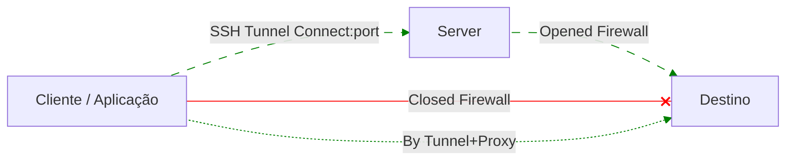

## Tipos de Túneis e Suas Aplicações

### 1. Túnel SSH (SSH Tunneling)

**Descrição:**
Utiliza o protocolo SSH para encapsular e criptografar tráfego TCP.

**Tipos:**

- Local Forward (`-L`)
- Remote Forward (`-R`)
- Dynamic Forward / SOCKS (`-D`)

**Aplicações:**

- Acesso seguro a serviços internos
- Proxy SOCKS5
- Administração remota
- Bypass de firewall
- Debug e troubleshooting

**Exemplo comum:**
Encaminhar uma porta local para um banco de dados interno.

### 2. Túnel SOCKS (SOCKS4 / SOCKS5)

**Descrição:**
Proxy genérico em nível de aplicação que encaminha conexões TCP (e UDP no SOCKS5).

**Aplicações:**

- Navegação segura
- Redirecionamento de tráfego de aplicações
- Testes de saída por outro IP
- Integração com browsers, curl, git, proxychains

**Observação:**
SOCKS não cifra por si só — normalmente é combinado com SSH ou VPN.

### 3. VPN (Virtual Private Network)

**Descrição:**
Cria uma rede virtual criptografada entre dispositivos ou redes inteiras.

**Protocolos comuns:**

- OpenVPN
- WireGuard
- IPsec
- L2TP
- PPTP (legado / inseguro)

**Aplicações:**

- Interligação de filiais
- Acesso remoto corporativo
- Segurança em redes públicas
- Extensão de rede privada

### 4. Túnel IPsec

**Descrição:**
Tunelamento em nível de rede (camada 3), focado em segurança e integridade.

**Modos:**

- Transport Mode
- Tunnel Mode

**Aplicações:**

- Site-to-site VPN
- Conexões corporativas de alta segurança
- Infraestrutura crítica

### 5. Túnel GRE (Generic Routing Encapsulation)

**Descrição:**
Encapsula diversos protocolos dentro de IP, sem criptografia nativa.

**Aplicações:**

- Interligação de redes
- Transporte de protocolos não-IP
- Ambientes controlados

**Observação:**
Normalmente combinado com IPsec para segurança.

### 6. Túnel HTTP / HTTPS (HTTP CONNECT)

**Descrição:**
Encapsula conexões TCP dentro de HTTP/HTTPS.

**Aplicações:**

- Bypass de proxies restritivos
- Ambientes corporativos bloqueados
- Ferramentas como `corkscrew`, `proxytunnel`

### 7. Reverse Tunnel

**Descrição:**
O túnel é iniciado de dentro da rede privada para fora, permitindo acesso reverso.

**Aplicações:**

- Expor serviços atrás de NAT
- Acesso remoto sem IP público
- CI/CD, IoT, suporte técnico

**Exemplo:**
SSH Remote Forward (`ssh -R`).

### 8. Túnel UDP

**Descrição:**
Encapsula tráfego UDP dentro de TCP ou outro protocolo.

**Aplicações:**

- Jogos
- VoIP
- Streaming
- Ambientes com bloqueio de UDP

### 9. Túnel de Porta (Port Forwarding)

**Descrição:**
Redirecionamento direto de portas entre origem e destino.

**Aplicações:**

- Acesso a bancos de dados
- APIs internas
- Serviços legados

## Considerações Finais

O tunelamento é um **componente fundamental da engenharia de redes modernas**, permitindo flexibilidade, segurança e controle do tráfego. A escolha do tipo de túnel ideal depende de fatores como:

- Nível de segurança necessário
- Tipo de tráfego (TCP/UDP)
- Performance
- Complexidade operacional
- Ambiente (corporativo, cloud, on-premises)

## Tabela Comparativa Geral

| Tipo de Túnel      | Camada OSI | Criptografia | TCP      | UDP        | Escopo    | Casos de Uso Típicos                        |
| ------------------ | ---------- | ------------ | -------- | ---------- | --------- | ------------------------------------------- |
| **SSH Tunnel**     | L7         | ✅ Sim        | ✅        | ❌          | Aplicação | Acesso seguro, proxy SOCKS, port forwarding |
| **SOCKS4/5**       | L5/L7      | ❌ Não        | ✅        | ⚠️ (SOCKS5) | Aplicação | Proxy genérico, redirecionamento            |
| **OpenVPN**        | L3/L4      | ✅ Sim        | ✅        | ✅          | Rede      | VPN site-to-site, acesso remoto             |
| **WireGuard**      | L3         | ✅ Sim        | ❌        | ✅          | Rede      | VPN moderna, alto desempenho                |
| **IPsec**          | L3         | ✅ Sim        | ❌        | ❌          | Rede      | VPN corporativa, site-to-site               |
| **GRE**            | L3         | ❌ Não        | ❌        | ❌          | Rede      | Encapsular protocolos, roteamento           |
| **GRE + IPsec**    | L3         | ✅ Sim        | ❌        | ❌          | Rede      | Túneis corporativos seguros                 |
| **HTTP CONNECT**   | L7         | ⚠️ HTTPS      | ✅        | ❌          | Aplicação | Bypass de proxy/firewall                    |
| **Reverse Tunnel** | Variável   | Variável     | Variável | Variável   | Aplicação | Expor serviços internos                     |
| **Port Forward**   | L4/L7      | Variável     | ✅        | ❌          | Serviço   | Acesso pontual a serviços                   |

## Quando Usar Cada Um (Resumo Rápido)

| Cenário                              | Melhor Opção   |
| ------------------------------------ | -------------- |
| Acesso rápido e pontual              | SSH Tunnel     |
| Proxy para várias apps               | SOCKS5 via SSH |
| VPN moderna e rápida                 | WireGuard      |
| VPN corporativa tradicional          | IPsec          |
| Encapsular redes sem segurança       | GRE            |
| Firewall bloqueando tudo exceto HTTP | HTTP CONNECT   |
| Servidor atrás de NAT                | Reverse Tunnel |

## Diagramas por Tipo de Túnel (Mermaid)

## 🔹 SSH Tunnel – Local Port Forward (`ssh -L`)

📌 **Uso:** acessar serviço interno remotamente

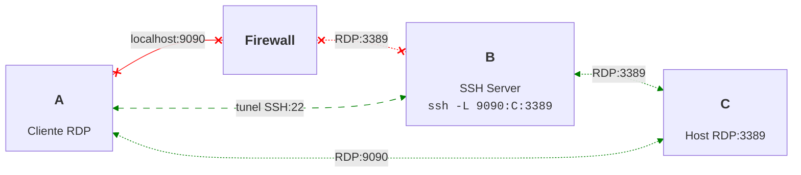

✔ Seguro
✔ Ideal para DB, APIs internas
❌ Não escala para muitos serviços

## 🔹 SSH Tunnel – SOCKS5 (`ssh -D`)

📌 **Uso:** proxy dinâmico para múltiplos destinos

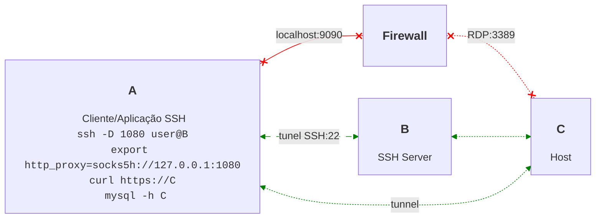

✔ Muito flexível
✔ DNS remoto (`socks5h`)
⚠️ Depende do app suportar SOCKS

## 🔹 SOCKS Proxy (Sem Criptografia)

📌 **Uso:** redirecionamento simples

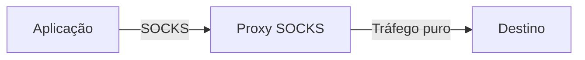

❌ Sem criptografia
✔ Leve
⚠️ Use apenas em redes confiáveis

## 🔹 VPN (OpenVPN / WireGuard)

📌 **Uso:** interligar redes inteiras

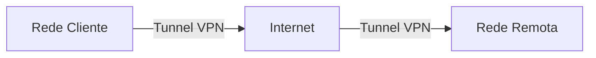

✔ Transparente para apps
✔ Alto nível de segurança
✔ Ideal para ambientes corporativos

## 🔹 IPsec – Site to Site

📌 **Uso:** interligar datacenters/filiais

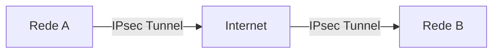

✔ Padrão corporativo
✔ Alto desempenho
⚠️ Configuração mais complexa

## 🔹 GRE Tunnel

📌 **Uso:** encapsular protocolos e rotas

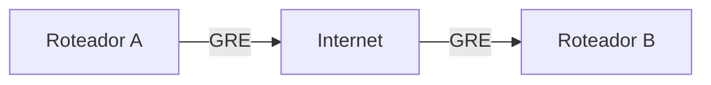

❌ Sem criptografia
✔ Muito flexível
⚠️ Normalmente usado com IPsec

## 🔹 GRE + IPsec

📌 **Uso:** flexibilidade + segurança

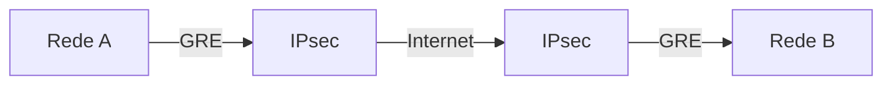

✔ Seguro
✔ Roteamento avançado
✔ Ambientes complexos

## 🔹 HTTP CONNECT Tunnel

📌 **Uso:** bypass de proxy/firewall

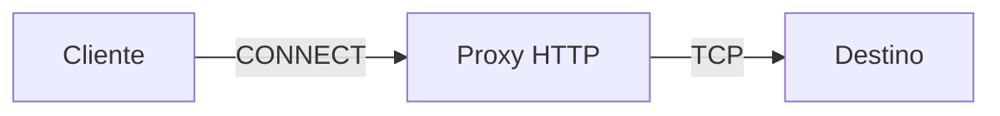

✔ Funciona onde só HTTP passa
❌ Dependente do proxy
⚠️ Latência maior

## 🔹 Reverse Tunnel (SSH -R)

📌 **Uso:** expor serviço atrás de NAT

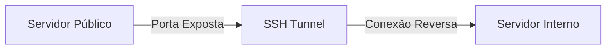

✔ Ideal para IoT, suporte, CI/CD
✔ Sem IP público
✔ Muito usado em cloud

## 🔹 Port Forwarding Simples

📌 **Uso:** acesso direto a um serviço

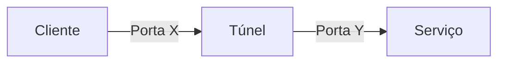

✔ Simples
✔ Direto
❌ Pouca flexibilidade

## Conclusão Técnica

- **SSH** → melhor custo-benefício para acesso rápido
- **SOCKS5** → flexibilidade para apps
- **VPN** → solução definitiva e transparente
- **IPsec/GRE** → ambientes corporativos e roteamento avançado
- **Reverse Tunnel** → NAT, cloud, acesso externo controlado

Outros:

- adaptar isso para **PDF / Markdown / Wiki**
- criar **checklist de decisão**
- montar **exemplos de configuração reais**
- integrar com **Docker, Kubernetes, HAProxy ou systemd**
