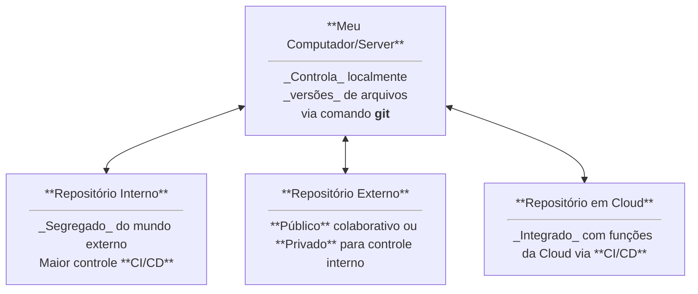

# [git](/Books/TI/Dev/Git.md)/[GiHub](/Books/TI/Dev/GiHub.md)/[GitLab](https://gitlab.com/)

- **git**: [/Books/TI/Dev/Git.md](/Books/TI/Dev/Git.md)
  - Linha de comandos para controle de versão.
  - Este se conecta nos vários repositórios abaixo mencionados
- **GiHub**: [/Books/TI/Dev/GiHub.md](/Books/TI/Dev/GiHub.md)  (free com limitações/pago)
  - Repositório de controle de versão com Foco em Colaboração e Comunidade
    - Controle de DevOps em Núvem
- **GitLab**: https://gitlab.com/ (free com limitações/pago)
  - A Plataforma DevOps Completa Cloud/On Premise
    - Self-Managed: Repositório privativo
      - Pacote para instalação / Host como GitHub
    - SaaS - Software as a Service:
      - Similar ao GiHub
- Outros Repositórios:
  - **Azure Repos**: https://azure.microsoft.com/pt-br/products/devops/repos/
    - Solução em núvem com integração nativa com o ecossistema Azure, incluindo Azure Pipelines para CI/CD, Boards para gerenciamento de projetos e Artifacts para gerenciamento de pacotes
  - **AWS CodeCommit**: https://aws.amazon.com/pt/codecommit/
    - Integrado com cloud Amazon Web Services.
  - **Google Cloud Source Repositories**: https://www.google.com/search?q=https://cloud.google.com/source-repositories
    - Totalmente integrado ao Google Cloud Platform (+CI/CD e monitoramento) com sincronização com GitHub e Bitbucket
  - **OCI DevOps Code Repositories**: https://www.oracle.com/br/cloud/devops/
    - Integrado com cloud Oracle.
  - **Bitbucket**: https://bitbucket.org/
    - Foco em equipes empresariais, integração profunda com o ecossistema Atlassian
  - **SourceForge**: https://sourceforge.net/
    - Foco em projetos open source, distribuição de arquivos e grande base de usuários para descoberta de software.
  - **Launchpad**: https://launchpad.net/
    - Foco para projetos de software open source, com um foco especial no ecossistema Ubuntu/Canonical
  - **Gitea**: https://gitea.io/
    - Git auto-hospedado Extremamente leve em recursos, rápido e simples de configurar, ideal para servidores pequenos ou NAS
  - **Gogs**: https://gogs.io/
    - O Gitea foi um fork do Gogs.
