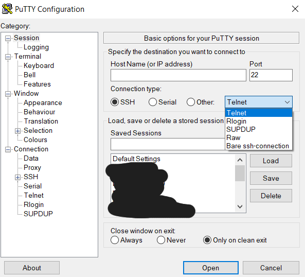

# PUTTY

https://www.putty.org/

Sempre Portable, é um software para conexão em terminais para linha de comando.

Suporta os protocolos: SSH, Telnet, Serial, entre outros

Boas práticas de Configuração:

- Configurar arquivo de log:
  - `Session`
    - `Loggin`
      - `All session output`
      - `Log file name`: C:\full_path\putty_&H_&Y&M&D_&T.log
- Tamanho do buffer do terminal:
  - `Windows`
    - `Lines of scrollback`: 1410065407 (máximo)
    - `Tranlation`
      - `Remote character set`: UTF-8
- Manter conectado
  - `Connection`
    - `Seconds between keepalive (o to turn off)`: 15
- Salvar defalut
  - `Session`
    - in `Saved Sessions`
      - at the list, click in `Default Settings`
      - click in button `Save`
