# Tunnel

Imagine que você quer acessar um serviço em um servidor, mas esse serviço está bloqueado ou é inseguro. Com um túnel SSH, você pode:

1. **Conectar-se ao servidor remoto usando SSH.** Isso já cria uma conexão criptografada e segura.
2. **Redirecionar o tráfego de uma porta local para uma porta no servidor remoto (ou vice-versa) através dessa conexão SSH.** É como se você estendesse a segurança da sua conexão SSH para aquele serviço específico.

**Por que usar?**

- **Segurança:** Proteger dados que passariam por uma rede não criptografada.
- **Acesso a serviços restritos:** Acessar serviços que estão atrás de um firewall ou que só podem ser alcançados de dentro de uma rede específica.

Em resumo, é uma maneira de **encapsular** tráfego de rede inseguro dentro de uma conexão SSH segura, permitindo o acesso a recursos restritos ou protegendo a comunicação.

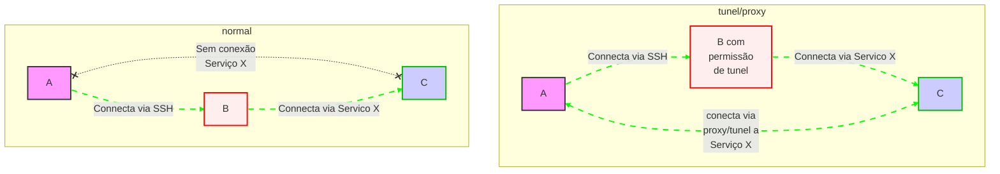

## Dinâmico

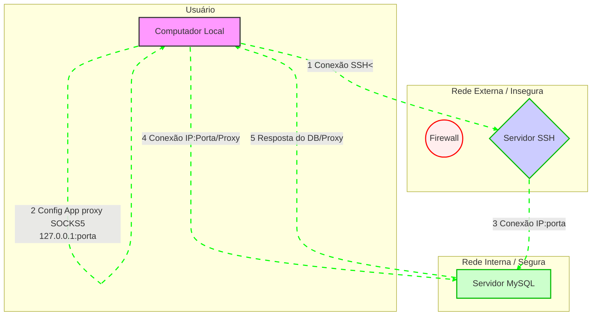

Criar

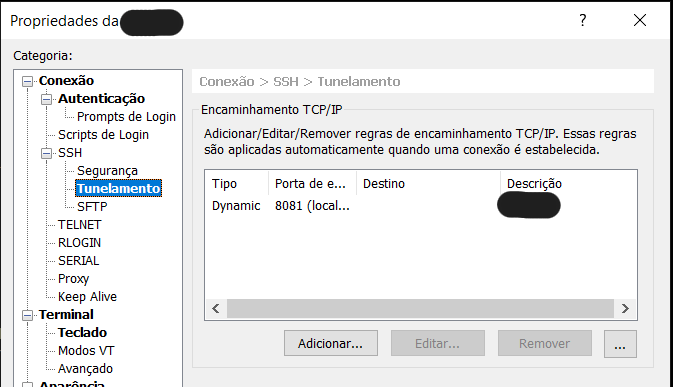
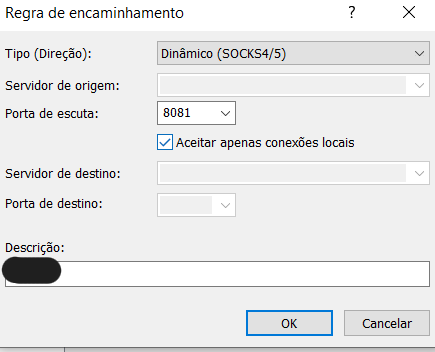
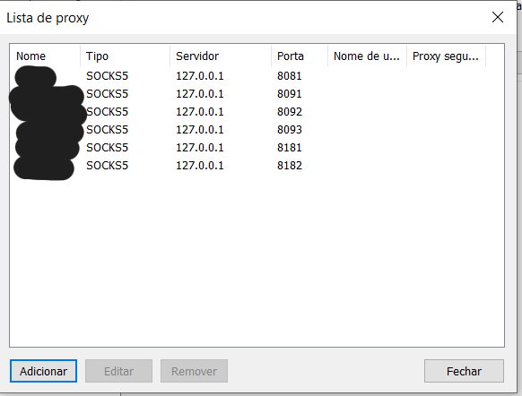

Usar:
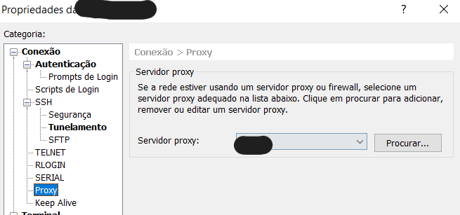
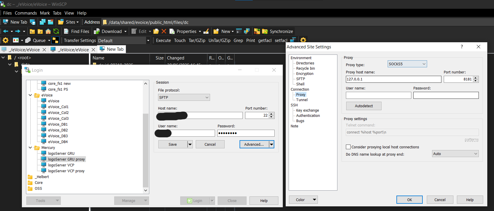

## Local

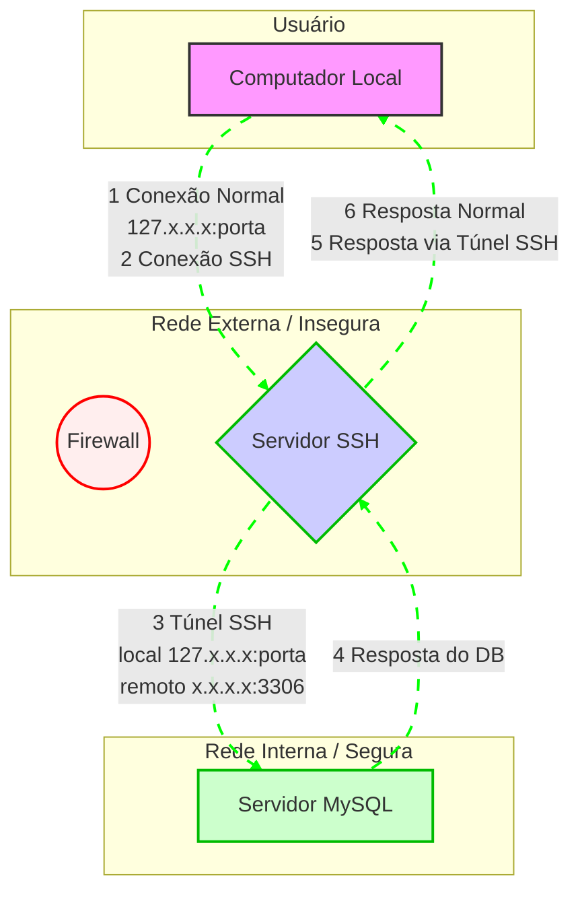

Criar:
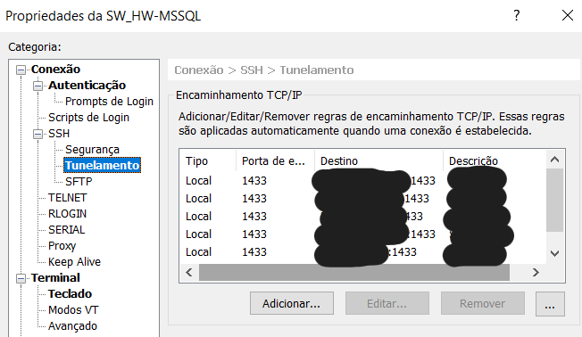
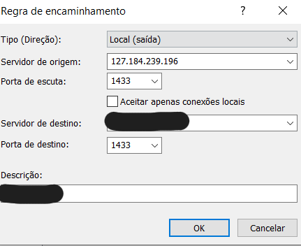

Usar:
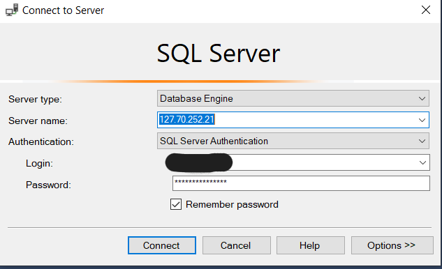
