# VSCode

https://code.visualstudio.com/download

- Workspaces
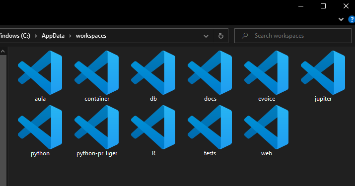
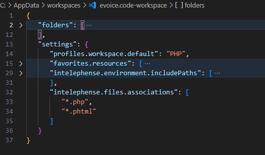

- Configurações
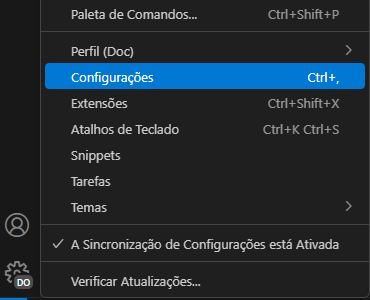
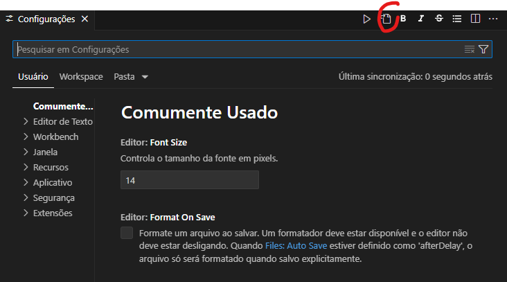
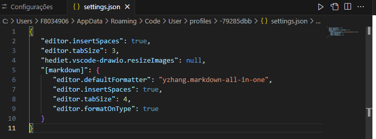

- Perfis
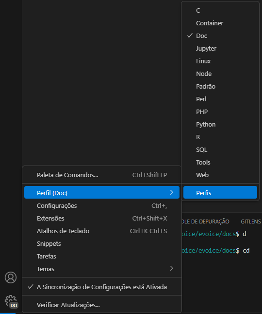
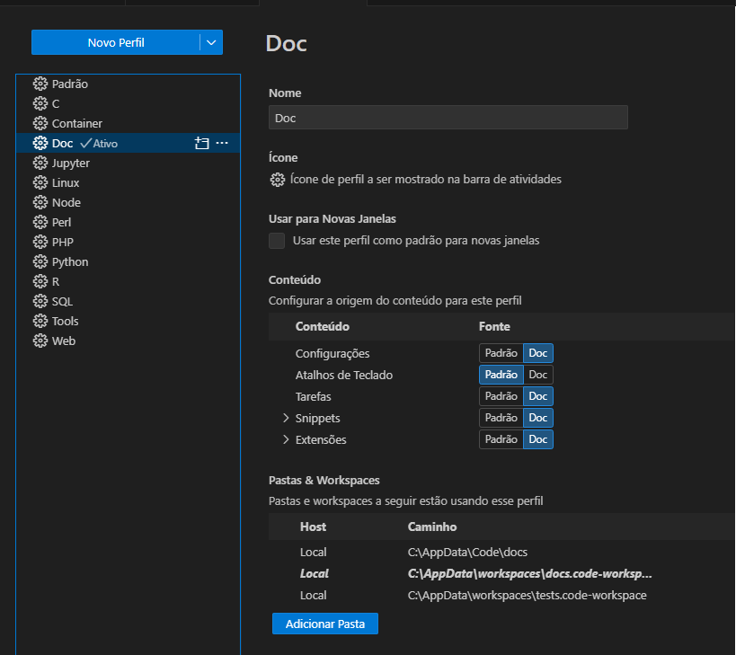

- Extenções [/Projects/eVoice/App.md](/Projects/eVoice/App.md)
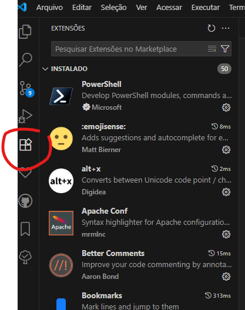

- Integração com Git
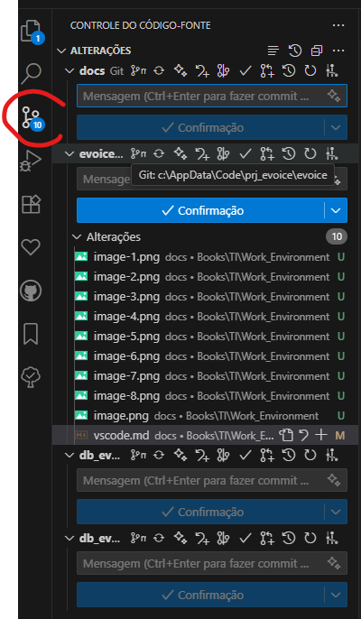

- Outras Extensões
  - Extensão TODO Tree [[TODOs]]
  - Favoritos

- Sincronia de Configurações via Git
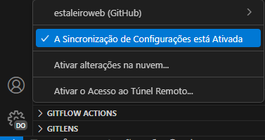

- Hot keys
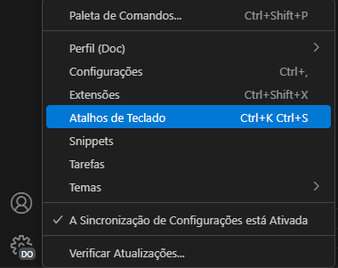

- Paleta de comandos
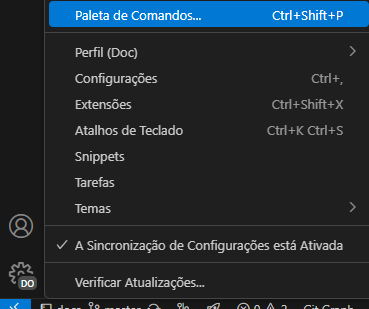
