# XShell

https://www.xshell.com/en/xshell/

Como o PUTTY  XShell é um conector para terminais com muito mais "poder de fogo".

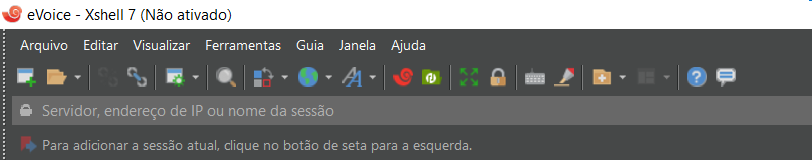
Ele permite auto login, multi guias entre outros artifícios

## Config Geral

Boas práticas de Configuração:

- Configurar CTRL+A para Selecionar Tudo
  - Menu: `Ferramentas/Opções` `Mapeamento de teclado`
    - `Editar`
      - `Novo`
        - Pressione a hot-key `CTRL+A`
        - `Ação Tipo`: `Menu`
        - `Menu`: `[Editar] Selecionar tudo`
        - `OK`
- Configurar os botões do mouse para um padrão PUTTY, Shell VSCode etc
  - Menu: `Ferramentas/Opções` `Mouse`
    - `Botão do Meio`: `Abrir o menu popup`
    - `Botão Direito`: `Colar o conteúdo da área de transferência`
- Seleção:
  - [[Duplo_Clique]] vs [[SHIFT]]+[[Duplo_Clique]]
    - [[Duplo_Clique]]: Seleciona com delimitadores específicados
    - [[SHIFT]]+[[Duplo_Clique]]: Seleciona com delimitadores espaços

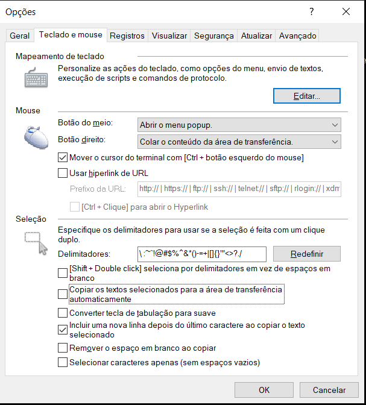

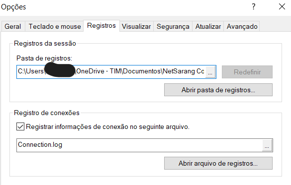

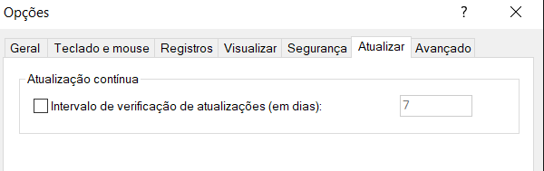

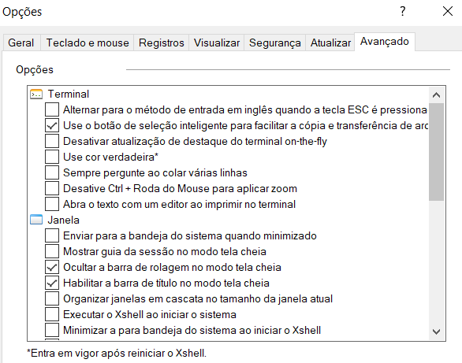

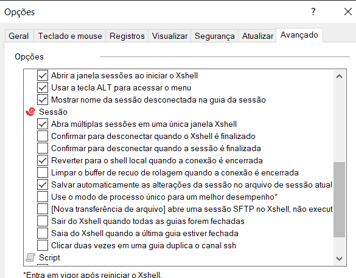

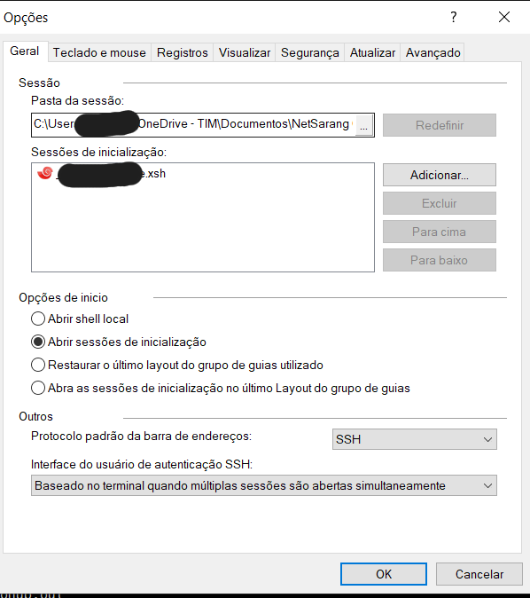

## Sessões

Sessão é uma conexão salva que você pode com um simples clique acessá-la sem uso de credenciais (caso não altere a senha) mantendo todo o seu ambiente de terminal configurado para a determinada situação.

Ele....:
- permite pastas
- permite configuração default (geral/por pasta)
- pode ser configurado de forma multipla.

Configurando uma sessão básica:

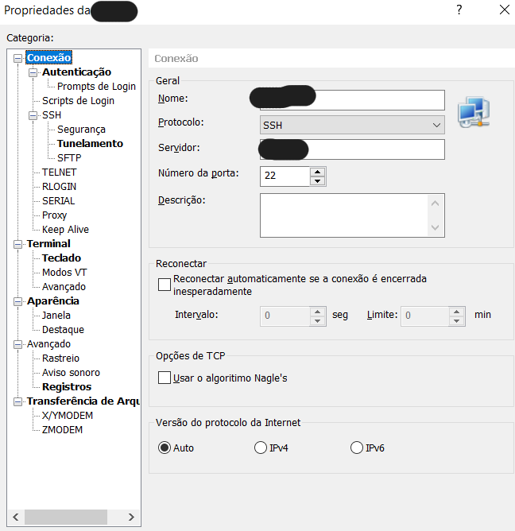

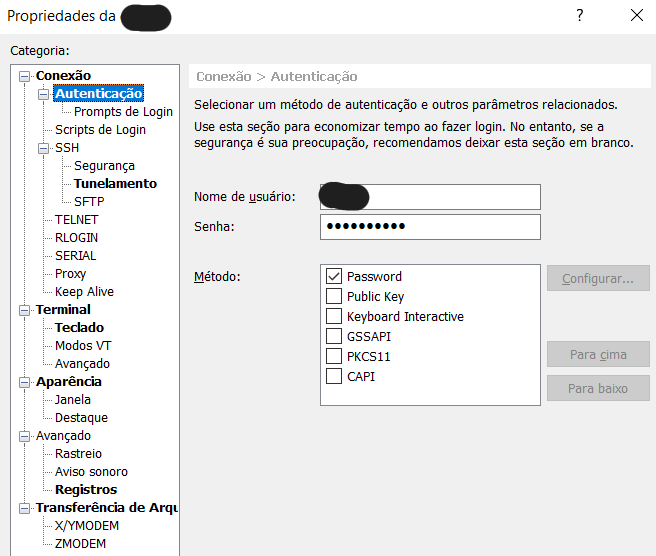

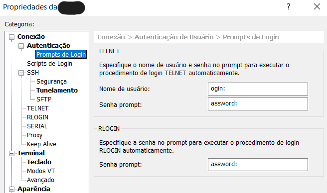

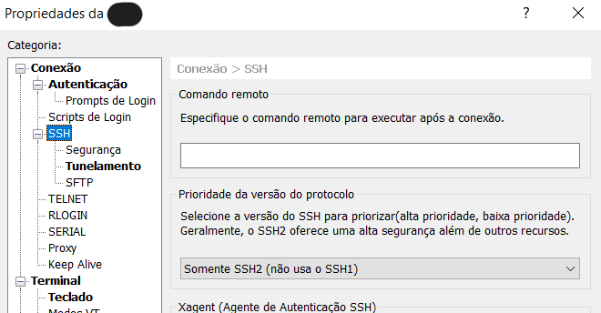

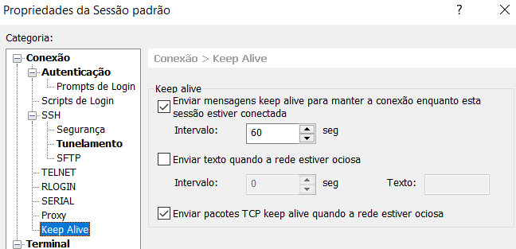

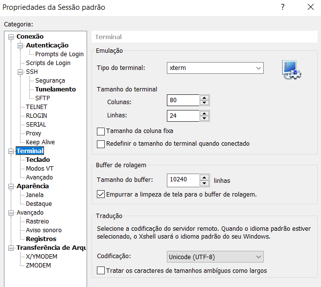

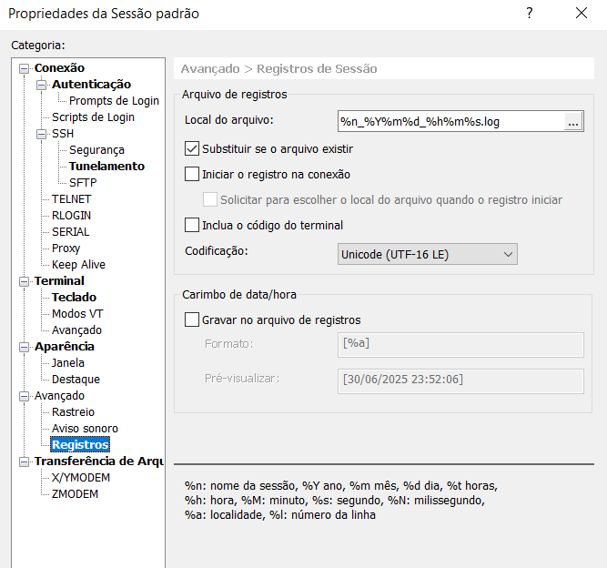 Tome cuidado com padrões que tem `:` no windows

## Terminal

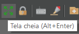

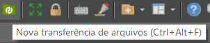

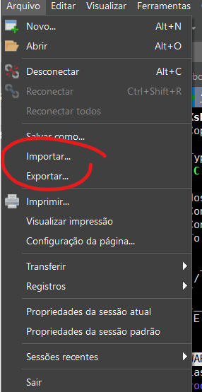

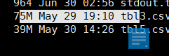

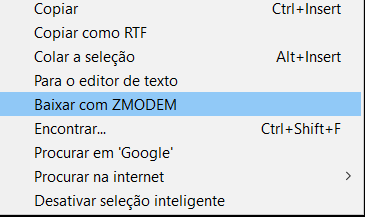
