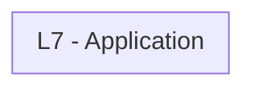
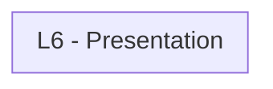
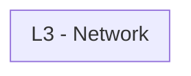

# Redes - Modelo OSI

```mermaid
	flowchart BT

	subgraph L7[L7 - Application]
		direction LR
	end
```

```mermaid
	flowchart BT

	subgraph L6[L6 - Presentation]
		direction LR
	end
```

```mermaid
	flowchart BT

	subgraph L5[L5 - Session]
		direction LR
	end
```

```mermaid
	flowchart BT

	subgraph L4[L4 - Transport]
		direction LR
	end
```

```mermaid
	flowchart BT

	subgraph L3[L3 - Network]
		direction LR
	end
```

```mermaid
	flowchart BT

	subgraph L2[L2 - Data Link]
		direction LR
		L2-ISO9577>ISO 9577]
		L2-ETHERTYPE>Ethertype]
		L2-LLC802>LLC 802.2]

		subgraph L2-IP[IP]
			direction LR
			subgraph L2-LAN-Tunneling[Tunneling]
				direction TB
				L2-LAN-Tunneling-L2F(L2F)
				L2-LAN-Tunneling-L2TP(L2TP)
				L2-LAN-Tunneling-PPTP(PPTP)
			end
			L2-LAN-ARP(ARP,RARP,IARP,SLARP)
		end
		subgraph L2-LAN[LAN]
			direction LR
			L2-LAN-BPDU(BPDU)
			L2-LAN-IEEE802.3CD(IEEE 802.3 CD/CSMA)
			L2-LAN-IEEE802.3AB(IEEE 802.3 AB)
			L2-LAN-IEEE802.1Q(IEEE 802.1Q)-->
			L2-LAN-IEEE802.1p(IEEE 802.1p)
			L2-LAN-SNAP(SNAP)
		end
		subgraph L2-VoIP[VoIP]
			L2-WAN-H223(H223)
			L2-WAN-LAP(LAP v 5DL)
		end
		subgraph L2-Phone-V5[Phone:V5]
			direction LR
			L2-WAN-V5(V5)-->
			L2-WAN-LAPV5(LAPV5)
		end
		subgraph L2-Phone-SS7[Phone:SS7]
			L2-Phone-SS7-MTP2(MTP2)
		end
		subgraph L2-Phone-UMTS[Phone:UMTS]
			L2-Phone-UMTS-MAC(MAC)
			L2-Phone-UMTS-FP(FP)
		end
		subgraph L2-ATM[ATM]
			direction LR
			L2-ATM-CIF(CIF)
			L2-ATM-ILMI(ILMI)
			
			L2-ATM-MPOA(MPOA)
			L2-ATM-CES(CES)
			
			L2-ATM-LANE(LANE)
			L2-ATM-Q.93B(Q.93B)
			L2-ATM-Q.2140(Q.2140)
			L2-ATM-Q.SAAL(Q.SAAL)
			subgraph L2-ATM-Signaling[Signaling]
				L2-ATM-UNI(UNI/NNI)
				L2-ATM-Q.2971(Q.2971)
				L2-ATM-Q.2931(Q.2931)
			end

			L2-ATM-Cells(Cells)
			L2-ATM-IMA(IMA)
			L2-ATM-SSCOP(SSCOP)
			L2-ATM-PNNI(PNNI)
			L2-ATM-OAM(OAM)

			subgraph L2-ATM-AAL[AAL]
				L2-ATM-AAL-AAL1(AAL1)
				L2-ATM-AAL-AAL2(AAL2)
				L2-ATM-AAL-AAL34(AAL3/4)
				L2-ATM-AAL-AAL5(AAL5)
			end
		end
		subgraph L2-FR[Frame Relay]
			direction LR
			L2-FR-T1.617(T1.617)
			L2-FR-Q.933(Q.933)
			L2-FR-SVC(SVC)
			L2-FR-LMI(LMI)
			L2-FR-LAPF(LAPF)
			L2-FR-CLLM(CLLM)
			L2-FR-FRF(FRF 9/11/12)
			L2-FR-HDLC(HDLC)
			L2-FR-LAPB(LAPB)
			L2-FR-SLE(Cisco SLE)
		end
		subgraph L2-Phone-GPRS[Phone:GPRS]
			direction LR
			L2-Phone-GPRS-BSSGP(BSSGP)
			L2-Phone-GPRS-NS(NS-Network)
			L2-Phone-RLC-MAC(RLC-MAC)
			L2-Phone-PCU(PCU)
		end
		subgraph L2-ISDN[ISDN]
			direction LR
			L2-ISDN-Q.931(Q.931)
			L2-ISDN-LAPD(LAPD)
		end
		subgraph L2-PPP[PPP]
			direction LR
			
			L2-PPP-PPP(PPP)
			L2-PPP-Grp1(PAP,LEX-LAN,SDTP,BAP,LQR,LCP,EAP,CHAP)
			L2-PPP-Grp2(MPPC,MLP,LZS)
			L2-PPP-PPP-BPDU(BPDU)
			L2-PPP-Control(Control Protocols: IPXCP,OSINLCP,CSCP,BCP,ECP,SDCP,LEXCP,SPCP,BACP,CCP,IPCP)
		end
	end

	subgraph L1[L1 - Physical]
		direction LR
		L1-VET>V,E,T Series]

		subgraph L1-LAN[LAN]
			direction LR
			L1-LAN-BASE(10/100/1000-BASE-T)
			L1-LAN-GBE(GBE:1000-BASE-LX/SX/CX)
		end
		subgraph L1-WAN[WAN]
			direction LR
			L1-LAN-10GBE(10GBE)
		end
		subgraph L1-WAN/ATM[WAN/ATM]
			direction LR
			L1-WAN-PLCP(PLCP:DS0/1/3,G703)
			L1-WAN-SDH(SDH:OC-1,STM-1/4/16/48/192)
			L1-WAN-PDH(PDH:DS1/2/3,E1/3)
		end
		subgraph L1-ATM[ATM]
			direction LR
			L1-ATM-xDSL(xDSL:H/A/S DSL)
			L1-ATM-ATM(ATM)
			L1-ATM-PLCP(PLCP:DS1/2/3/4,E1/3)
		end
		subgraph L2-Phone-SS7[Phone:SS7]
			L1-WAN-MTP1(MTP1)
		end
		subgraph L1-FR[Frame Relay]
			direction LR
			L1-FR-Interface(Interface:V11/24/35/36,Rs-530,HSSI)
			L1-FR-Modem(Modem:V21/22/27/29/32/33/26/42)
		end
		subgraph L1-ISDN[ISDN]
			direction LR
			L1-ISDN-ISDN(ISDN-B/D/HD/H11/H12)
		end
	end

	L1-.-L2-.-L3-.-L4-.-L5-.-L6-.-L7
```
