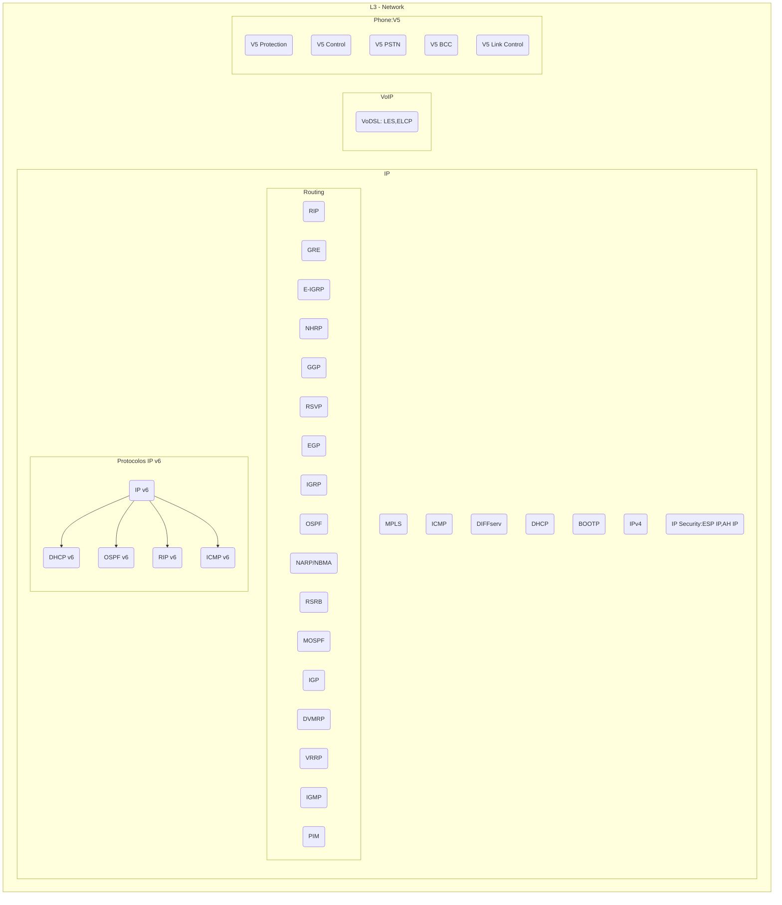
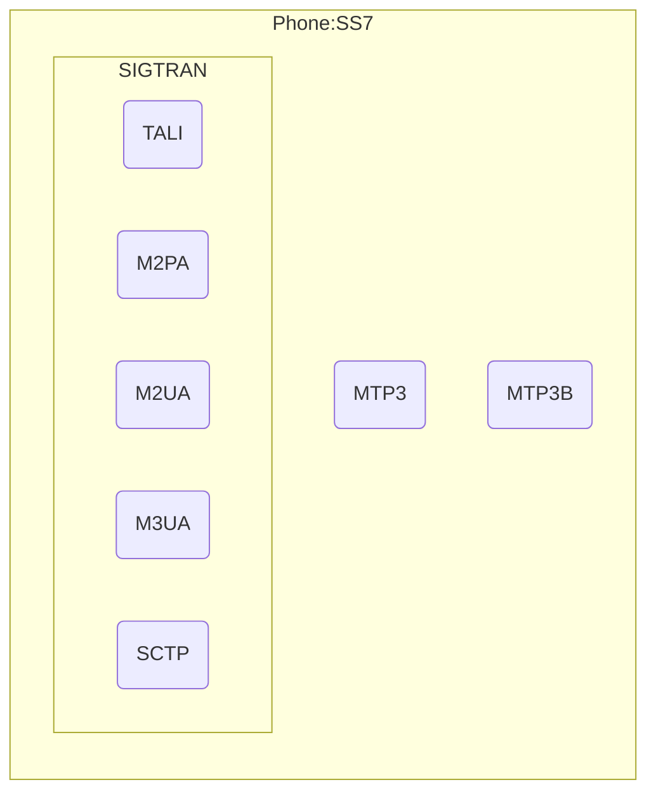

```mermaid
	flowchart BT

	subgraph L3[L3 - Network]
		direction LR
		subgraph L3-IP[IP]
			subgraph L3-IP-Routing[Routing]
				L3-IP-Routing-RIP(RIP)
				L3-IP-Routing-GRE(GRE)
				L3-IP-Routing-E-IGRP(E-IGRP)
				L3-IP-Routing-NHRP(NHRP)
				L3-IP-Routing-GGP(GGP)
				L3-IP-Routing-RSVP(RSVP)
				L3-IP-Routing-EGP(EGP)
				L3-IP-Routing-IGRP(IGRP)
				L3-IP-Routing-OSPF(OSPF)
				L3-IP-Routing-NARP/NBMA(NARP/NBMA)
				L3-IP-Routing-RSRB(RSRB)
				L3-IP-Routing-MOSPF(MOSPF)
				L3-IP-Routing-IGP(IGP)
				L3-IP-Routing-DVMRP(DVMRP)
				L3-IP-Routing-VRRP(VRRP)
				L3-IP-Routing-IGMP(IGMP)
				L3-IP-Routing-PIM(PIM)
			end
			L3-IP-MPLS(MPLS)
			L3-IP-ICMP(ICMP)
			L3-IP-DIFFserv(DIFFserv)
			L3-IP-DHCP(DHCP)
			L3-IP-BOOTP(BOOTP)
			L3-IP-IPv4(IPv4)
			subgraph L3-IP-v6[Protocolos IP v6]
				L3-IP-v6-IPv6(IP v6)
				L3-IP-v6-DHCPv6(DHCP v6)
				L3-IP-v6-OSPFv6(OSPF v6)
				L3-IP-v6-RIPv6(RIP v6)
				L3-IP-v6-ICMPv6(ICMP v6)

				L3-IP-v6-IPv6-->L3-IP-v6-DHCPv6 &  L3-IP-v6-OSPFv6 & L3-IP-v6-RIPv6 & L3-IP-v6-ICMPv6
			end
			L3-IP-Security(IP Security:ESP IP,AH IP)
		end
		subgraph L3-VoIP[VoIP]
			VoDSL(VoDSL: LES,ELCP)
		end
		subgraph L3-Phone-V5[Phone:V5]
			L3-Phone-V5-Protection(V5 Protection)
			L3-Phone-V5-Control(V5 Control)
			L3-Phone-V5-PSTN(V5 PSTN)
			L3-Phone-V5-BCC(V5 BCC)
			L3-Phone-V5-Link(V5 Link Control)
		end
	end
```

```mermaid
	flowchart BT

		subgraph L3-Phone-SS7[Phone:SS7]
			subgraph L3-Phone-SS7-SIGTRAN[SIGTRAN]
				L3-Phone-SS7-SIGTRAN-TALI(TALI)
				L3-Phone-SS7-SIGTRAN-M2PA(M2PA)
				L3-Phone-SS7-SIGTRAN-M2UA(M2UA)
				L3-Phone-SS7-SIGTRAN-M3UA(M3UA)
				L3-Phone-SS7-SIGTRAN-SCTP(SCTP)
			end
			L3-Phone-SS7-MTP3(MTP3)
			L3-Phone-SS7-MTP3B(MTP3B)
		end
```

```mermaid
	flowchart BT

		subgraph L3-LAN[LAN]
		end
		subgraph L3-WAN[WAN]
		end
		subgraph L3-WAN/ATM[WAN/ATM]
		end
		subgraph L3-ATM[ATM]
		end
		subgraph L3-FR[Frame Relay]
		end
		subgraph L3-ISDN[ISDN]
		end
		subgraph L3-PPP[PPP]
		end
		subgraph L3-IP[IP]
		end
		subgraph L3-VoIP[VoIP]
		end
		subgraph L3-X25[X25]
		end
		subgraph L3-ISO[ISO]
		end
		subgraph L3-Phone-SS7[Phone:SS7]
		end
		subgraph L3-Phone-UMTS[Phone:UMTS]
		end
		subgraph L3-Phone-GPRS[Phone:GPRS]
		end
		subgraph L3-Phone-CDMA2000[Phone:CDMA2000]
		end
		subgraph L3-Phone-WAP[Phone:WAP]
		end
		subgraph L3-Phone-V5[Phone:V5]
		end
		subgraph L3-LAN[LAN]
		end
		subgraph L3-WAN[WAN]
		end
		subgraph L3-ATM[ATM]
		end
		subgraph L3-FR[Frame Relay]
		end
		subgraph L3-ISDN[ISDN]
		end
		subgraph L3-PPP[PPP]
		end
```

