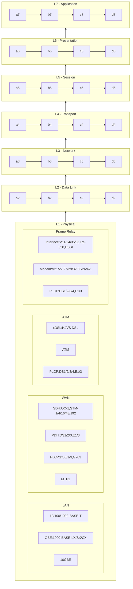

# Redes - Modelo OSI

## Summary

subgraph L1[L1 - Physical]
	a1-->a2
en1-->c1-->d1
subgraph 1wo[Dois]
	direction BT
	b1-->b2
end
subgraph three
	c1-->c2
end

c1-->a2
one --> three
two --> c2

- L1: Eth/SMDS->
- L2: VLan/Lan/WiFi->ARP->
  - Eth->CSMA/CD (Carrier-sense multiple access/collision Detection)->
    ```php
    do{
    	while(meio transmissão is not ok);
    	send data;
    	if(colidiu){
    		print(colidiu);
    		sleep(rand());
    	}
    }while(colidiu);
    ```
  - WiFi->
    - CSMA/CA (Carrier-sense multiple access/collision avoidance)->

      ```php
      do{
      	while(meio transmissão is not ok);
      	send data;
      	if(confirmou) sleep(rand());
      }while(confirmou);
      ```
    - CSMA/CA with RTS/CTS->

      - RTS A -> AP
      - CTS A <- AP (50ms)
      - send RTS;
      - recebe(CTS);

      ```php
      if(CTS>0) {
      	AP sent(CTS wait to other clients);
      	do CSMA/CA no time CTS(50ms);
      }
      ```

      - recebe(ACK);
- L3: IP->MPLS/BGP/OSPF->ICMP/IGMP/DHCP->
- L4: TCP/(UDP->RTP/RAS)->
- L5: DNS/LDAP/Diameter->RADIUS->/SIP-T/SIP/RTP/H245->
- L7: HTTP,HTTPS,SSH,FTP,TFTP,TELNET,SMTP,POP3,SNMP,IMAP,XWindows,TACACS,RADIUS

## Camada 1 - Física (Inreface Física)

- Eth/GEth
  | Grp  | Base        | Protocol     | Meio    | Dist  | Obs              |
  | ---- | ----------- | ------------ | ------- | ----- | ---------------- |
  | Eth  | 10-BASE     | 10-BASE-2    | Coaxial | 500m  |                  |
  | Eth  | 10-BASE     | 10-BASE-5    | Coaxial | 185m  |                  |
  | Eth  | 10-BASE     | 10-BROAD-36  | Coaxial | 3.5Km |                  |
  | Eth  | 10-BASE     | 10-BASE-T    | 4paresT | 100m  |                  |
  | Eth  | 10-BASE     | 10-BASE-F    | Fibra   | 2Km   | Manchester       |
  | Eth  | 100-BASE    | 100-BASE-TX  | 4paresT | 100m  | Cat5, 4B/5B      |
  | Eth  | 100-BASE    | 100-BASE-FX  | Fibra   | 185m  | 4B/5B+MLT-3      |
  | Eth  | 100-BASE    | 100-BASE-T4  | 4paresT | 100m  | Cat3,8B/6T+NRZ-I |
  | GEth | IEEE 802.3z | 1000-BASE-T4 | 4paresT | 100m  | 4D-PAM5          |
  | GEth | IEEE 802.3z | 1000-BASE-CX | STP     | 25m   | 8B/10B+NRZ       |
  | GEth | IEEE 802.3z | 1000-BASE-SX | Fibra   | 550m  | 8B/10B+NRZ       |
  | GEth | IEEE 802.3z | 1000-BASE-LX | Fibra   | 5Km   | 8B/10B+NRZ       |
  | GEth | 10GBE       | 10-GBASE-SR  | Fibra   | >300m |                  |
  | GEth | 10GBE       | 10-GBASE-LR  | Fibra   | 10Km  |                  |
  | GEth | 10GBE       | 10-GBASE-ER  | Fibra   | 40Km  |                  |
  | GEth | 10GBE       | 10-GBASE-CX4 | 4paresT | 15m   |                  |
  | GEth | 10GBE       | 10-GBASE-T4  | 4paresT | 100m  | UTP Cat6         |
- WAN/SMDS:       STM-1, STM-4, STM-16, STM-48, STM-192
- WAN/SMDS: OC-1, OC-3,  OC-12, OC-48,  OC-192, OC-768
- WAN/SMDS: G703
- WAN/SMDS/ATM: E1, E3, T1, DS1/2/3/4
- ATM: DSL, ADSL, HDSL, SDSL RADSL
- FrameRelay: V11, V21, V22, V24, V26, V27, V29, V32, V33, V35, V36, V42
- FrameRelay: RS-232, RS-449, RS-350, HSSI, X21, AT&T

## Camada 2 - Enlace ou Ligação 

Conexão Primária/Elétrica/Endereçamento Físico

- ARP, RARP, IARP, SLARP
- MTP2, MAC, MLP
- PPP
- Q.2140 (SS7)
- VLan Trunk: 802.1
- IEEE 802.1Q Trunk
- IEEE 802.1p QOS/MAC
- IEEE 802.1ad Stack/Pilha -> ponte de provedor para transporte de - clientes
- Lan: 802.3
  | IEEE    | PADRÃO    | Velocidade    | Obs                                   |
  | ------- | ---------- | ------------- | ------------------------------------- |
  | 802.3   | Eth        | 10 Mbit/s     | Ethernet                              |
  | 802.3u  | Fast Eth   | 100 Mbit/s    | Ethernet                              |
  | 802.3z  | Gigabit    | 1 Gbit/s      | para UTP (1000baseT)                  |
  | 802.3ab | Gigabit    | 1 Gbit/s      | para UTP (1000baseT)                  |
  | 802.3an | 10 Gigabit | 10 Gbit/s     | Ethernet                              |
  | 802.3en | 10 Gigabit | 10 Gbit/s     | Ethernet                              |
  | 802.3ae | 10 Gigabit | 10 Gbit/s     | Ethernet                              |
  | 802.3ba | -          | 40~100 Gbit/s | Experimental/redes de alta velocidade |
- WiFi: 802.11

| IEEE           | Freqüência | Ano  | Largura do canal | Modulação | MIMO    | User   | Velocidade    | Wi-Fi | Distância |
| -------------- | ------------ | ---- | ---------------- | ----------- | ------- | ------ | ------------- | ----- | ---------- |
| 802.11ax       | 6GHz         | 2019 | 20/40/80/160MHz  | OFDM/OFDMA  | MU-MIMO | Multi  | 2.4~9.6Gbps1  | 6E    | 125~250m   |
| 802.11ax       | 2.4/5GHz     | 2019 | 20/40/80/160MHz  | OFDM/OFDMA  | MU-MIMO | Multi  | 2.4~9.6Gbps1  | 6     | 125~250m   |
| 802.11ac wave2 | 5GHz         | 2014 | 20/40/80/160MHz  | OFDM        | MU-MIMO | Multi  | 1.73~3.5Gbps2 | 5     | 125~250m   |
| 802.11ac wave1 | 5GHz         | 2014 | 20/40/80MHz      | OFDM        | SU-MIMO | Único | 866.7Mbps2    | 5     | 125~250m   |
| 802.11n        | 5GHz         | 2009 | 20/40MHz         | OFDM        | SU-MIMO | Único | 450Mbps3      | 4     | 70~140m    |
| 802.11n        | 2.4GHz       | 2009 | 20/40MHz         | OFDM        | SU-MIMO | Único | 150Mbps3      | 4     | 125~250m   |
| 802.11g        | 2.4GHz       | 2003 | 20MHz            | OFDM        | -       | -      | 54Mbps        | 3     | 19~11m     |
| 802.11a        | 5GHz         | 1999 | 20MHz            | OFDM        | -       | -      | 54Mbps        | 3     | 60~119m    |
| 802.11b        | 2.4GHz       | 1999 | 20MHz            | HR-DSSS     | -       | -      | 11Mbps        | 2     | 70~140m    |
| Legacy 802.11  | 2.4GHz/IR    | 1997 | 20MHz            | FHSS/DSSS   | -       | -      | 1~2Mbps       | 1     | -          |

## Camada 3 - Rede (Endereçamento Lógico)

- IP->MPLS, RSVP, IGMP, DHCP
- SIP L3 to Frame Relay
- BGP, OSPF, RIP, ICMP
- SMS, GPRS, PSTN
- X25, X75
- NetBIOS NetBEUI

## Camada 4 - Transporte (Conexão)

- TCP, UDP, SNMP, RTP
- NetBIOS to SMB

## Camada 5 - Sessão (Sincronização)

- DNS, LDAP
- NetBIOS to SMB

## Camada 6 - Apresentação (Conversão/Criptografia)

## Camada 7 - Aplicação (Função requerida/repondida)

- HTTP,HTTPS,SSH,FTP,TFTP,TELNET,SMTP,POP3,SNMP,IMAP,XWindows,TACACS,- RADIUS
- IRC,Gopher
- GSM,G711,G722,G728,G723.1
- H261,H263,H264,MPEG-2,MPEG-4
- ISUP,INAP,ISDN,CAMEL
- NFS,NIS,SMB,MOUNT
- X500
- SMS
