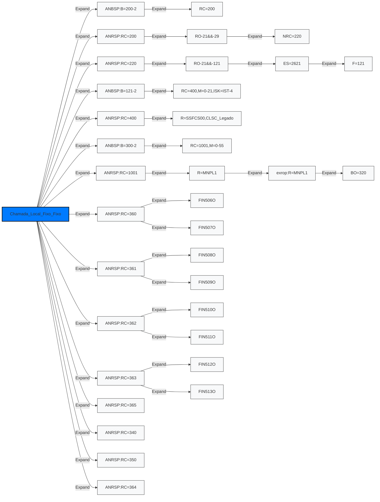

# Configurações Ericsson

```mermaid
flowchart LR
    Ericsson_MSC["Chamada_Local_Fixo_Fixo"]:::root
    Ericsson_MSC -->|Expand| anbsp_b_200_2["ANBSP:B=200-2"]
    anbsp_b_200_2 -->|Expand| RC_200["RC=200"]
    Ericsson_MSC -->|Expand| anrsp_200["ANRSP:RC=200"]
    anrsp_200 -->|Expand| RO-21&&-29["RO-21&&-29"]
    RO-21&&-29 -->|Expand| NRC_220["NRC=220"]
    Ericsson_MSC -->|Expand| anrsp_220["ANRSP:RC=220"]
    anrsp_220 -->|Expand| RO-21&&-121["RO-21&&-121"]
    RO-21&&-121 -->|Expand| ES_2621["ES=2621"]
    ES_2621 -->|Expand| F_121["F=121"] 
    Ericsson_MSC -->|Expand| anbsp_b_121_2["ANBSP:B=121-2"]
    anbsp_b_121_2 -->|Expand| RC_400["RC=400,M=0-21,ISK=IST-4"]
    Ericsson_MSC -->|Expand| anrsp_400["ANRSP:RC=400"]
    anrsp_400 -->|Expand| SSFCS00["R=SSFCS00,CLSC_Legado"]
    Ericsson_MSC -->|Expand| anbsp_b_300_2["ANBSP:B=300-2"]
    anbsp_b_300_2 -->|Expand| RC_1001["RC=1001,M=0-55"]
    Ericsson_MSC -->|Expand| anrsp_1001["ANRSP:RC=1001"]
    anrsp_1001 -->|Expand| MNPL1["R=MNPL1"]
    MNPL1 -->|Expand| exrop_r_MNPL1["exrop:R=MNPL1"]
    exrop_r_MNPL1 -->|Expand| exrop_["BO=320"]
    


    Ericsson_MSC -->|Expand| anrsp_360["ANRSP:RC=360"]
    anrsp_360 -->|Expand| FIN506O["FIN506O"]
    anrsp_360 -->|Expand| FIN507O["FIN507O"]
    Ericsson_MSC -->|Expand| anrsp_361["ANRSP:RC=361"]
    anrsp_361 -->|Expand| FIN508O["FIN508O"]
    anrsp_361 -->|Expand| FIN509O["FIN509O"]
    Ericsson_MSC -->|Expand| anrsp_362["ANRSP:RC=362"]
    anrsp_362 -->|Expand| FIN510O["FIN510O"]
    anrsp_362 -->|Expand| FIN511O["FIN511O"]
    Ericsson_MSC -->|Expand| anrsp_363["ANRSP:RC=363"]
    anrsp_363 -->|Expand| FIN512O["FIN512O"]
    anrsp_363 -->|Expand| FIN513O["FIN513O"]
    Ericsson_MSC -->|Expand| anrsp_365["ANRSP:RC=365"]
    Ericsson_MSC -->|Expand| anrsp_340["ANRSP:RC=340"]
    Ericsson_MSC -->|Expand| anrsp_350["ANRSP:RC=350"]
    Ericsson_MSC -->|Expand| anrsp_364["ANRSP:RC=364"]

    classDef root fill:#007bff,stroke:#000,stroke-width:2px;
    classDef default fill:#f8f9fa,stroke:#333,stroke-width:1px;
```
